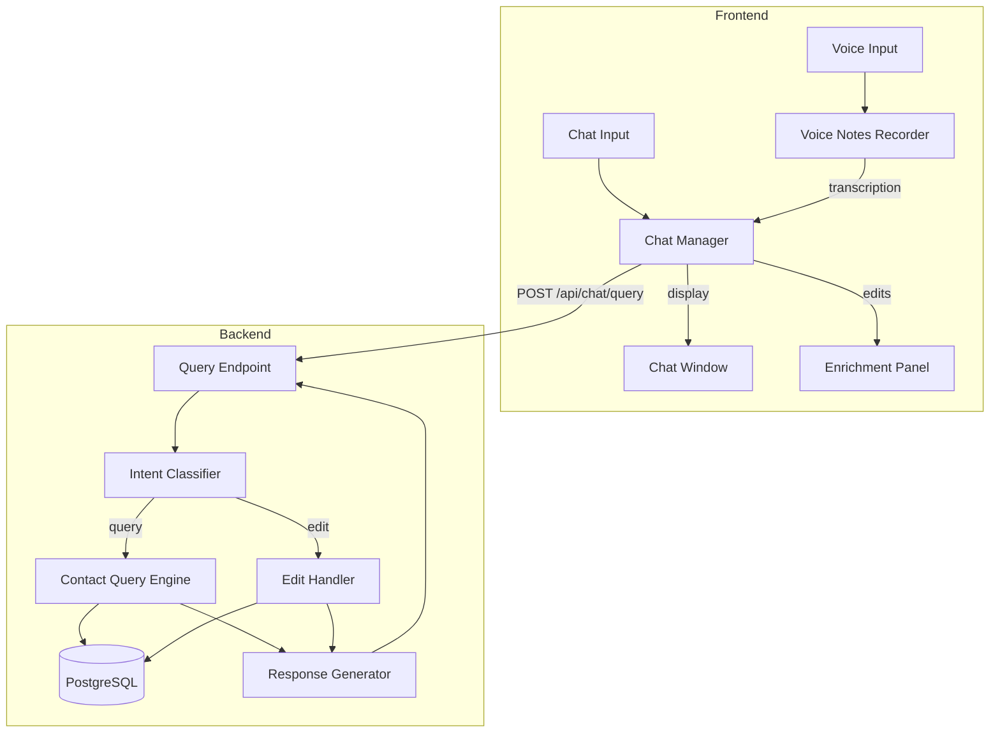

# Design Document: Contact-Aware Chatbot

## Overview

This feature extends the CatchUp chatbot to understand and respond to natural language queries about the user's contact data. The chatbot will use Google Gemini API for intent classification and query interpretation, then execute queries against the PostgreSQL database to return relevant contacts. The feature integrates seamlessly with the existing contact edit workflow, allowing users to query contacts and then apply batch edits in a conversational flow.

The architecture follows a pipeline pattern:
1. **Input Processing**: Text from chat or transcribed voice input
2. **Intent Classification**: Determine if the message is a query, edit command, or general chat
3. **Query/Edit Execution**: Process the intent against contact data
4. **Response Generation**: Format results for display (text) or speech (voice mode)

## Architecture



## Components and Interfaces

### 1. Intent Classifier (`src/chat/intent-classifier.ts`)

Classifies user messages into intents using Google Gemini API.

```typescript
interface IntentClassificationResult {
  intent: 'query' | 'edit' | 'followup' | 'general';
  confidence: number;
  entities: {
    locations?: string[];
    tags?: string[];
    groups?: string[];
    circles?: string[];
    timeExpressions?: string[];
    contactNames?: string[];
    fields?: { name: string; value: string }[];
  };
  filters?: QueryFilter[];
  editAction?: EditAction;
}

interface QueryFilter {
  field: string;
  operator: 'equals' | 'contains' | 'before' | 'after' | 'in';
  value: string | string[] | Date;
}

interface EditAction {
  type: 'add_tag' | 'remove_tag' | 'add_to_group' | 'update_field';
  target: 'context' | 'named';  // 'context' = use edit context, 'named' = specific contact
  contactName?: string;
  value: string;
  field?: string;
}

class IntentClassifier {
  constructor(geminiClient: GeminiClient);
  
  async classify(
    message: string, 
    conversationContext: ConversationContext
  ): Promise<IntentClassificationResult>;
}
```

### 2. Contact Query Engine (`src/chat/contact-query-engine.ts`)

Executes queries against the contact database.

```typescript
interface QueryResult {
  contacts: Contact[];
  totalCount: number;
  page: number;
  pageSize: number;
  hasMore: boolean;
  matchedFilters: string[];  // Human-readable filter descriptions
}

interface ConversationContext {
  previousQuery?: QueryResult;
  editContext: Contact[];  // Contacts available for batch edits
  lastIntent?: IntentClassificationResult;
}

class ContactQueryEngine {
  constructor(db: DatabasePool);
  
  async executeQuery(
    userId: string,
    filters: QueryFilter[],
    options?: { page?: number; pageSize?: number; sortBy?: string }
  ): Promise<QueryResult>;
  
  buildSqlQuery(filters: QueryFilter[]): { sql: string; params: any[] };
}
```

### 3. Chat Edit Handler (`src/chat/chat-edit-handler.ts`)

Creates pending edits from chat commands.

```typescript
interface BatchEditResult {
  editsCreated: number;
  editIds: string[];
  affectedContacts: { id: string; name: string }[];
}

class ChatEditHandler {
  constructor(db: DatabasePool, pendingEditsService: PendingEditsService);
  
  async createBatchEdits(
    userId: string,
    sessionId: string,
    editAction: EditAction,
    contacts: Contact[]
  ): Promise<BatchEditResult>;
  
  async createSingleEdit(
    userId: string,
    sessionId: string,
    editAction: EditAction,
    contact: Contact
  ): Promise<{ editId: string }>;
}
```

### 4. Response Generator (`src/chat/response-generator.ts`)

Formats query results and edit confirmations for display.

```typescript
interface ChatResponse {
  text: string;           // Display text
  speechText?: string;    // TTS-optimized text (for voice mode)
  contacts?: Contact[];   // Structured contact data for UI rendering
  editContext?: Contact[]; // Contacts available for follow-up edits
  actions?: ChatAction[]; // Quick action buttons
  requiresConfirmation?: boolean;
  confirmationData?: any;
}

interface ChatAction {
  label: string;
  type: 'view_profile' | 'schedule_catchup' | 'apply_edit' | 'show_more';
  data: any;
}

class ResponseGenerator {
  formatQueryResult(result: QueryResult, forVoice: boolean): ChatResponse;
  formatEditConfirmation(result: BatchEditResult): ChatResponse;
  formatNoResults(filters: QueryFilter[]): ChatResponse;
  formatError(error: Error): ChatResponse;
}
```

### 5. Chat Query API Endpoint (`src/api/routes/chat-query.ts`)

REST endpoint for processing chat queries.

```typescript
// POST /api/chat/query
interface ChatQueryRequest {
  message: string;
  sessionId: string;
  conversationContext?: {
    editContextIds?: string[];  // Contact IDs in current edit context
    previousQueryFilters?: QueryFilter[];
  };
  isVoiceMode?: boolean;
}

interface ChatQueryResponse {
  response: ChatResponse;
  newContext: {
    editContextIds: string[];
    lastQueryFilters: QueryFilter[];
  };
}
```

### 6. Time Expression Parser (`src/chat/time-parser.ts`)

Parses natural language time expressions into dates.

```typescript
interface ParsedTimeExpression {
  type: 'relative' | 'absolute' | 'range';
  startDate?: Date;
  endDate?: Date;
  description: string;
}

class TimeExpressionParser {
  parse(expression: string, referenceDate?: Date): ParsedTimeExpression;
}
```

## Data Models

### Conversation Context (In-Memory/Session)

```typescript
interface ConversationSession {
  sessionId: string;
  userId: string;
  editContext: string[];  // Contact IDs available for batch edits
  lastQueryResult?: {
    contactIds: string[];
    filters: QueryFilter[];
    timestamp: Date;
  };
  messageHistory: {
    role: 'user' | 'assistant';
    content: string;
    timestamp: Date;
  }[];
}
```

### Extended Pending Edit (Database)

The existing `pending_edits` table will be used with a new source type:

```sql
-- Existing table, new source value
-- source column will accept 'chat_query' in addition to 'voice_transcript'
```

## Correctness Properties

*A property is a characteristic or behavior that should hold true across all valid executions of a system-essentially, a formal statement about what the system should do. Properties serve as the bridge between human-readable specifications and machine-verifiable correctness guarantees.*

Based on the prework analysis, the following properties have been identified. Redundant properties have been consolidated.

### Property 1: Location filter correctness
*For any* contact dataset and location query, all returned contacts SHALL have a location field that matches (contains or equals) the queried location.
**Validates: Requirements 1.2**

### Property 2: Tag filter correctness
*For any* contact dataset and tag query, all returned contacts SHALL have the queried tag in their tags array.
**Validates: Requirements 1.4**

### Property 3: Last contact date sorting
*For any* query requesting contacts sorted by last contact date, the returned contacts SHALL be in ascending order by lastContactDate (oldest first).
**Validates: Requirements 1.3**

### Property 4: Synonym mapping consistency
*For any* query using a known synonym (e.g., "city" for "location"), the query SHALL produce the same results as using the canonical field name.
**Validates: Requirements 3.1**

### Property 5: Group/circle filter correctness
*For any* contact dataset and group/circle query, all returned contacts SHALL be members of the specified group or circle.
**Validates: Requirements 3.4**

### Property 6: Result formatting completeness
*For any* query result with contacts, the formatted response SHALL include name, the matching attribute, and lastContactDate for each contact.
**Validates: Requirements 4.2**

### Property 7: Pagination correctness
*For any* query returning more than 10 contacts, the response SHALL contain at most 10 contacts and hasMore SHALL be true.
**Validates: Requirements 4.3**

### Property 8: Edit context preservation
*For any* query that returns contacts, the edit context SHALL contain exactly those contact IDs.
**Validates: Requirements 5.1**

### Property 9: Batch edit creation
*For any* edit command targeting "them" or "these contacts", pending edits SHALL be created for all contacts in the current edit context.
**Validates: Requirements 5.2, 5.3**

### Property 10: Edit confirmation count accuracy
*For any* batch edit operation, the confirmation message SHALL contain the exact count of contacts in the edit context.
**Validates: Requirements 5.4**

### Property 11: SQL parameterization
*For any* generated SQL query, all user-provided values SHALL be passed as parameters, not interpolated into the query string.
**Validates: Requirements 6.2**

### Property 12: Time expression parsing
*For any* supported time expression format, the parser SHALL return a valid date or date range.
**Validates: Requirements 7.3**

### Property 13: Time-based filter correctness
*For any* time-based query, all returned contacts SHALL have lastContactDate within the specified time range.
**Validates: Requirements 7.1, 7.2**

### Property 14: Combined filter AND logic
*For any* query with multiple filters, all returned contacts SHALL satisfy ALL filter conditions.
**Validates: Requirements 8.1**

### Property 15: Intent classification correctness
*For any* message classified as a query intent, the response SHALL contain contact information (not edit confirmations).
**Validates: Requirements 9.1**

### Property 16: Pronoun resolution
*For any* edit command using "them" or "these contacts", the operation SHALL target exactly the contacts from the most recent query result.
**Validates: Requirements 9.4**

### Property 17: Edit source tagging
*For any* pending edit created from a chat query, the source field SHALL be set to "chat_query".
**Validates: Requirements 10.2**

### Property 18: Voice response TTS formatting
*For any* voice mode response, the speechText SHALL not contain special characters, markdown, or formatting that would sound unnatural when spoken.
**Validates: Requirements 2.2**

## Error Handling

### Input Validation Errors
- Empty or whitespace-only messages: Return helpful prompt
- Messages exceeding length limit (1000 chars): Truncate and warn
- Invalid session ID: Return 401 Unauthorized

### Query Execution Errors
- Database connection failure: Return 503 with retry suggestion
- Query timeout (>5s): Return partial results if available, else error
- Invalid filter values: Return 400 with specific field error

### Intent Classification Errors
- Gemini API failure: Fall back to keyword-based classification
- Low confidence (<0.5): Ask clarifying question
- Ambiguous intent: Present options to user

### Edit Errors
- Empty edit context: Return error explaining no contacts selected
- Contact not found: Return 404 with contact name
- Duplicate edit: Skip and note in response

## Testing Strategy

### Unit Testing
- Intent classifier with mocked Gemini responses
- Query builder SQL generation
- Time expression parser with various formats
- Response formatter output structure

### Property-Based Testing

The project will use **fast-check** for property-based testing in TypeScript.

Each property test MUST:
1. Be tagged with the format: `**Feature: contact-aware-chatbot, Property {number}: {property_text}**`
2. Run a minimum of 100 iterations
3. Reference the specific correctness property from this design document

Property tests will cover:
- Filter correctness (Properties 1, 2, 5, 13, 14)
- Sorting correctness (Property 3)
- Pagination behavior (Property 7)
- Edit context management (Properties 8, 9, 16)
- SQL safety (Property 11)
- Response formatting (Properties 6, 17, 18)

### Integration Testing
- End-to-end chat query flow
- Voice mode transcription → query → response
- Batch edit creation and enrichment panel display
