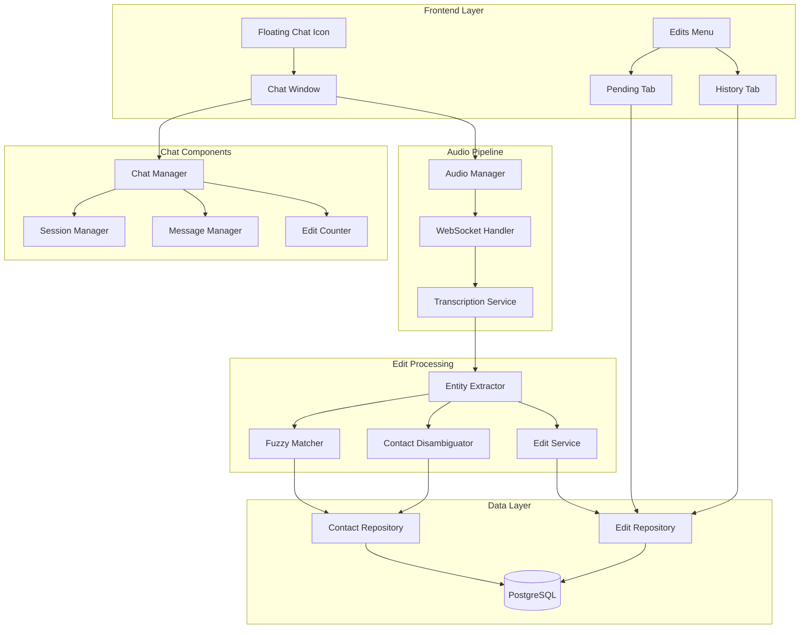

# Design Document: Incremental Chat Edits

## Overview

This feature transforms the existing voice notes recording flow into a conversational chat-based interface for capturing and managing contact edits. The system introduces a floating chat icon that enables incremental voice recording with real-time edit extraction, presenting suggestions in a pending edits queue with full source attribution and confidence scoring.

The architecture builds upon the existing voice transcription infrastructure while introducing new components for session management, edit tracking, and a conversational UI layer.

## Architecture



## Components and Interfaces

### 1. Floating Chat Icon Component

Persistent UI element that provides access to the chat interface.

```typescript
interface FloatingChatIconProps {
  isRecording: boolean;
  pendingEditCount: number;
  hasError: boolean;
  onClick: () => void;
}

interface FloatingChatIconState {
  isGlowing: boolean;      // Red glow when recording
  isPulsing: boolean;      // Pulse animation on new edit
  pulseCount: number;      // For animation timing
}

class FloatingChatIcon {
  // Renders fixed-position icon with state-based styling
  render(): HTMLElement;
  
  // Trigger pulse animation when edit detected
  triggerPulse(): void;
  
  // Update recording state (red glow)
  setRecordingState(isRecording: boolean): void;
  
  // Update error state
  setErrorState(hasError: boolean): void;
}
```

### 2. Chat Window Component

Overlay interface for conversational interaction.

```typescript
interface ChatWindowProps {
  isOpen: boolean;
  sessionId: string | null;
  messages: ChatMessage[];
  pendingEditCount: number;
  onClose: () => void;
  onCancelSession: () => void;
}

interface ChatMessage {
  id: string;
  type: 'user' | 'system';
  content: string;
  timestamp: Date;
  editReferences?: EditReference[];  // Clickable edit links
  disambiguationOptions?: DisambiguationOption[];
}

interface EditReference {
  editId: string;
  displayText: string;
  editType: EditType;
}

interface DisambiguationOption {
  contactId: string;
  contactName: string;
  similarityScore: number;
}

class ChatWindow {
  // Render chat overlay with message history
  render(): HTMLElement;
  
  // Add message to chat
  addMessage(message: ChatMessage): void;
  
  // Scroll to bottom of message list
  scrollToBottom(): void;
  
  // Handle edit reference click
  handleEditClick(editId: string): void;
  
  // Handle disambiguation selection
  handleDisambiguationSelect(contactId: string): void;
}
```

### 3. Session Manager

Manages chat session lifecycle and edit association.

```typescript
interface Session {
  id: string;
  userId: string;
  startedAt: Date;
  endedAt?: Date;
  status: 'active' | 'completed' | 'cancelled';
  editIds: string[];  // Edits created during this session
}

interface SessionManager {
  // Start new session
  startSession(userId: string): Promise<Session>;
  
  // End session (preserve edits)
  endSession(sessionId: string): Promise<void>;
  
  // Cancel session (remove all session edits)
  cancelSession(sessionId: string): Promise<void>;
  
  // Associate edit with session
  addEditToSession(sessionId: string, editId: string): void;
  
  // Get session edits
  getSessionEdits(sessionId: string): Promise<PendingEdit[]>;
}
```

### 4. Edit Service

Core service for managing pending edits and edit history.

```typescript
interface EditService {
  // Create pending edit from extraction
  createPendingEdit(params: CreateEditParams): Promise<PendingEdit>;
  
  // Update pending edit (e.g., change target contact)
  updatePendingEdit(editId: string, updates: EditUpdates): Promise<PendingEdit>;
  
  // Submit edit (apply and move to history)
  submitEdit(editId: string): Promise<EditHistoryEntry>;
  
  // Dismiss edit (remove without applying)
  dismissEdit(editId: string): Promise<void>;
  
  // Bulk dismiss session edits
  dismissSessionEdits(sessionId: string): Promise<void>;
  
  // Get pending edits for user
  getPendingEdits(userId: string): Promise<PendingEdit[]>;
  
  // Get edit history for user
  getEditHistory(userId: string, options?: HistoryOptions): Promise<EditHistoryEntry[]>;
}

interface CreateEditParams {
  userId: string;
  sessionId: string;
  editType: EditType;
  targetContactId?: string;
  targetContactName?: string;
  targetGroupId?: string;
  targetGroupName?: string;
  field?: string;
  proposedValue: any;
  confidenceScore: number;
  source: EditSource;
}

interface EditUpdates {
  targetContactId?: string;
  targetGroupId?: string;
  proposedValue?: any;
}

interface HistoryOptions {
  limit?: number;
  offset?: number;
  dateFrom?: Date;
  dateTo?: Date;
}
```

### 5. Fuzzy Matcher Service

Handles contact/group matching with similarity scoring.

```typescript
interface FuzzyMatchResult {
  id: string;
  name: string;
  type: 'contact' | 'group';
  similarityScore: number;  // 0-1
}

interface FuzzyMatcherService {
  // Search contacts by name
  searchContacts(
    userId: string, 
    query: string, 
    limit?: number
  ): Promise<FuzzyMatchResult[]>;
  
  // Search groups by name
  searchGroups(
    userId: string, 
    query: string, 
    limit?: number
  ): Promise<FuzzyMatchResult[]>;
  
  // Find best match for extracted name
  findBestMatch(
    userId: string, 
    extractedName: string
  ): Promise<FuzzyMatchResult | null>;
  
  // Calculate similarity score between two strings
  calculateSimilarity(str1: string, str2: string): number;
}
```

### 6. Incremental Edit Detector

Processes transcript segments for real-time edit extraction.

```typescript
interface IncrementalEditDetector {
  // Process transcript segment for edits
  processSegment(
    segment: TranscriptSegment,
    context: DetectionContext
  ): Promise<DetectedEdit[]>;
  
  // Get detection context for session
  getContext(sessionId: string): DetectionContext;
}

interface TranscriptSegment {
  text: string;
  timestamp: Date;
  isFinal: boolean;
  confidence: number;
}

interface DetectionContext {
  sessionId: string;
  userId: string;
  userContacts: Contact[];
  previousSegments: TranscriptSegment[];
  detectedEdits: DetectedEdit[];
}

interface DetectedEdit {
  editType: EditType;
  extractedName?: string;
  field?: string;
  value: any;
  confidence: number;
  sourceSegment: TranscriptSegment;
}
```

## Data Models

### PendingEdit

```typescript
interface PendingEdit {
  id: string;
  userId: string;
  sessionId: string;
  editType: EditType;
  targetContactId?: string;
  targetContactName?: string;
  targetGroupId?: string;
  targetGroupName?: string;
  field?: string;
  proposedValue: any;
  confidenceScore: number;
  source: EditSource;
  status: 'pending' | 'needs_disambiguation';
  disambiguationCandidates?: DisambiguationCandidate[];
  createdAt: Date;
  updatedAt: Date;
}

type EditType = 
  | 'create_contact'
  | 'update_contact_field'
  | 'add_tag'
  | 'remove_tag'
  | 'add_to_group'
  | 'remove_from_group'
  | 'create_group';

interface EditSource {
  type: 'voice_transcript' | 'text_input' | 'manual';
  transcriptExcerpt?: string;
  timestamp: Date;
  fullContext?: string;
}

interface DisambiguationCandidate {
  contactId: string;
  contactName: string;
  similarityScore: number;
}
```

### EditHistoryEntry

```typescript
interface EditHistoryEntry {
  id: string;
  userId: string;
  originalEditId: string;
  editType: EditType;
  targetContactId?: string;
  targetContactName?: string;
  targetGroupId?: string;
  targetGroupName?: string;
  field?: string;
  appliedValue: any;
  previousValue?: any;
  source: EditSource;
  submittedAt: Date;
}
```

### ChatSession

```typescript
interface ChatSession {
  id: string;
  userId: string;
  status: 'active' | 'completed' | 'cancelled';
  messages: ChatMessage[];
  editIds: string[];
  startedAt: Date;
  endedAt?: Date;
}
```

### Database Schema

```sql
-- Pending edits table
CREATE TABLE pending_edits (
  id UUID PRIMARY KEY DEFAULT gen_random_uuid(),
  user_id UUID NOT NULL REFERENCES users(id),
  session_id UUID NOT NULL,
  edit_type VARCHAR(50) NOT NULL,
  target_contact_id UUID REFERENCES contacts(id),
  target_contact_name VARCHAR(255),
  target_group_id UUID REFERENCES groups(id),
  target_group_name VARCHAR(255),
  field VARCHAR(100),
  proposed_value JSONB NOT NULL,
  confidence_score DECIMAL(3,2) NOT NULL,
  source JSONB NOT NULL,
  status VARCHAR(30) NOT NULL DEFAULT 'pending',
  disambiguation_candidates JSONB,
  created_at TIMESTAMP WITH TIME ZONE DEFAULT NOW(),
  updated_at TIMESTAMP WITH TIME ZONE DEFAULT NOW()
);

-- Edit history table (immutable)
CREATE TABLE edit_history (
  id UUID PRIMARY KEY DEFAULT gen_random_uuid(),
  user_id UUID NOT NULL REFERENCES users(id),
  original_edit_id UUID NOT NULL,
  edit_type VARCHAR(50) NOT NULL,
  target_contact_id UUID REFERENCES contacts(id),
  target_contact_name VARCHAR(255),
  target_group_id UUID REFERENCES groups(id),
  target_group_name VARCHAR(255),
  field VARCHAR(100),
  applied_value JSONB NOT NULL,
  previous_value JSONB,
  source JSONB NOT NULL,
  submitted_at TIMESTAMP WITH TIME ZONE DEFAULT NOW()
);

-- Chat sessions table
CREATE TABLE chat_sessions (
  id UUID PRIMARY KEY DEFAULT gen_random_uuid(),
  user_id UUID NOT NULL REFERENCES users(id),
  status VARCHAR(20) NOT NULL DEFAULT 'active',
  started_at TIMESTAMP WITH TIME ZONE DEFAULT NOW(),
  ended_at TIMESTAMP WITH TIME ZONE
);

-- Indexes
CREATE INDEX idx_pending_edits_user ON pending_edits(user_id);
CREATE INDEX idx_pending_edits_session ON pending_edits(session_id);
CREATE INDEX idx_edit_history_user ON edit_history(user_id);
CREATE INDEX idx_edit_history_submitted ON edit_history(submitted_at DESC);
CREATE INDEX idx_chat_sessions_user ON chat_sessions(user_id);
```


## Correctness Properties

*A property is a characteristic or behavior that should hold true across all valid executions of a system-essentially, a formal statement about what the system should do. Properties serve as the bridge between human-readable specifications and machine-verifiable correctness guarantees.*

Based on the acceptance criteria analysis, the following correctness properties must be validated through property-based testing:

### Property 1: Session Lifecycle Consistency

*For any* chat session, when the user reopens the chat interface, a new session with a unique ID shall be created and the message history shall be empty.

**Validates: Requirements 4.1, 4.7**

### Property 2: Edit-Session Association

*For any* edit detected during a session, the edit's sessionId field shall match the current active session ID.

**Validates: Requirements 4.2**

### Property 3: Session Cancellation Removes All Session Edits

*For any* session with N pending edits, when the session is cancelled, all N edits associated with that session shall be removed from the pending edits queue.

**Validates: Requirements 4.4**

### Property 4: Session Close Preserves Edits

*For any* session with N pending edits, when the chat interface is closed without cancellation, all N edits shall remain in the pending edits queue.

**Validates: Requirements 4.6**

### Property 5: Edit Extraction Metadata Validity

*For any* extracted edit, the confidence score shall be a number between 0 and 1 (inclusive), and the source object shall contain a non-null type and timestamp.

**Validates: Requirements 5.4, 5.5**

### Property 6: Pending Edit Display Completeness

*For any* pending edit, the rendered display shall include: edit type, target contact/group name, proposed value, confidence score as percentage, and source type.

**Validates: Requirements 7.1, 9.1, 9.2**

### Property 7: Fuzzy Search Ordering

*For any* fuzzy search query, the returned results shall be ordered by similarity score in descending order (highest similarity first).

**Validates: Requirements 7.3**

### Property 8: Edit Update Persistence

*For any* pending edit modification, after updating the target contact, the edit's targetContactId shall reflect the new value.

**Validates: Requirements 7.5**

### Property 9: Edit Submission Creates Immutable History

*For any* submitted edit, an EditHistoryEntry shall be created with matching edit type, target, applied value, and source, and subsequent update attempts on that history entry shall fail.

**Validates: Requirements 7.6, 10.1, 10.3**

### Property 10: Edit Dismissal Without Side Effects

*For any* dismissed edit, the edit shall be removed from pending edits and no changes shall be applied to the target contact or group.

**Validates: Requirements 7.7**

### Property 11: Disambiguation Trigger Threshold

*For any* edit with a contact match confidence score below 0.7, a disambiguation prompt shall be generated with at least 1 and at most 3 candidate contacts.

**Validates: Requirements 8.1, 8.2**

### Property 12: Disambiguation Resolution Updates Edit

*For any* disambiguation selection, the pending edit's targetContactId shall be updated to match the selected contact ID.

**Validates: Requirements 8.4**

### Property 13: Low Confidence Visual Indicator

*For any* pending edit with confidence score below 0.5, the edit shall be marked with a requiresReview flag set to true.

**Validates: Requirements 9.5**

### Property 14: Edit History Display Completeness

*For any* edit history entry, the rendered display shall include: timestamp, edit type, target contact/group name, applied value, and original source.

**Validates: Requirements 10.2**

### Property 15: Message Chronological Ordering

*For any* chat session with multiple messages, the messages shall be ordered by timestamp in ascending order (oldest first).

**Validates: Requirements 3.9**

### Property 16: Pending Edits Counter Accuracy

*For any* session, the pending edits counter value shall equal the count of pending edits associated with that session.

**Validates: Requirements 6.2**

### Property 17: Pending Edits Tab Completeness

*For any* user with N pending edits, the Pending Edits tab shall display exactly N edit items.

**Validates: Requirements 1.3**

### Property 18: Edit History Chronological Ordering

*For any* user's edit history, the entries shall be ordered by submittedAt timestamp in descending order (newest first).

**Validates: Requirements 1.4**

## Error Handling

### Audio Recording Errors

| Error | Handling |
|-------|----------|
| Microphone permission denied | Display error message with instructions to enable permissions |
| No microphone found | Display error message suggesting to connect a microphone |
| Audio stream interrupted | Attempt reconnection, buffer audio locally if disconnected |
| WebSocket connection lost | Exponential backoff reconnection (1s, 2s, 4s, max 10s) |

### Edit Processing Errors

| Error | Handling |
|-------|----------|
| Entity extraction fails | Log error, continue recording without creating edit |
| Contact lookup fails | Create edit with targetContactName only, mark for disambiguation |
| Edit submission fails | Display error, keep edit in pending state for retry |
| Database write fails | Retry with exponential backoff, notify user after 3 failures |

### Session Errors

| Error | Handling |
|-------|----------|
| Session creation fails | Display error, prevent recording until resolved |
| Session not found | Create new session automatically |
| Concurrent session conflict | Close existing session, start new one |

## Testing Strategy

### Property-Based Testing Framework

The implementation shall use **fast-check** for property-based testing in TypeScript/JavaScript.

Each property-based test shall:
- Run a minimum of 100 iterations
- Be tagged with a comment referencing the correctness property: `**Feature: incremental-chat-edits, Property {number}: {property_text}**`
- Use smart generators that constrain inputs to valid domain values

### Unit Tests

Unit tests shall cover:
- Individual component rendering (FloatingChatIcon, ChatWindow, EditItem)
- Service method behavior (EditService, SessionManager, FuzzyMatcher)
- Data transformation functions (suggestionsToProposal, calculateSimilarity)
- Edge cases (empty states, boundary values)

### Integration Tests

Integration tests shall verify:
- End-to-end edit flow from voice input to history
- WebSocket message handling
- Database operations for edit lifecycle
- Navigation between components

### Test Organization

```
src/
  edits/
    __tests__/
      edit-service.test.ts           # Unit tests
      edit-service.property.test.ts  # Property-based tests
      session-manager.test.ts
      fuzzy-matcher.test.ts
      fuzzy-matcher.property.test.ts
public/
  js/
    __tests__/
      floating-chat-icon.test.ts
      chat-window.test.ts
      edits-menu.test.ts
```

