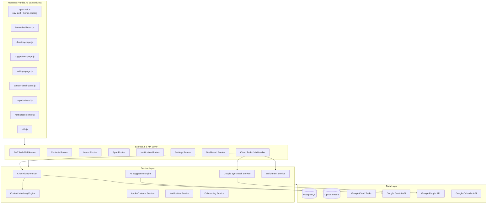
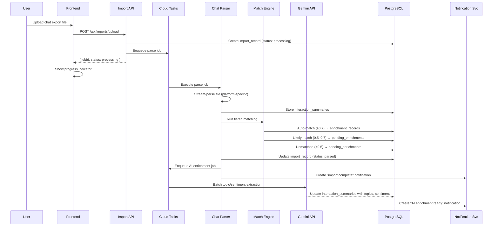
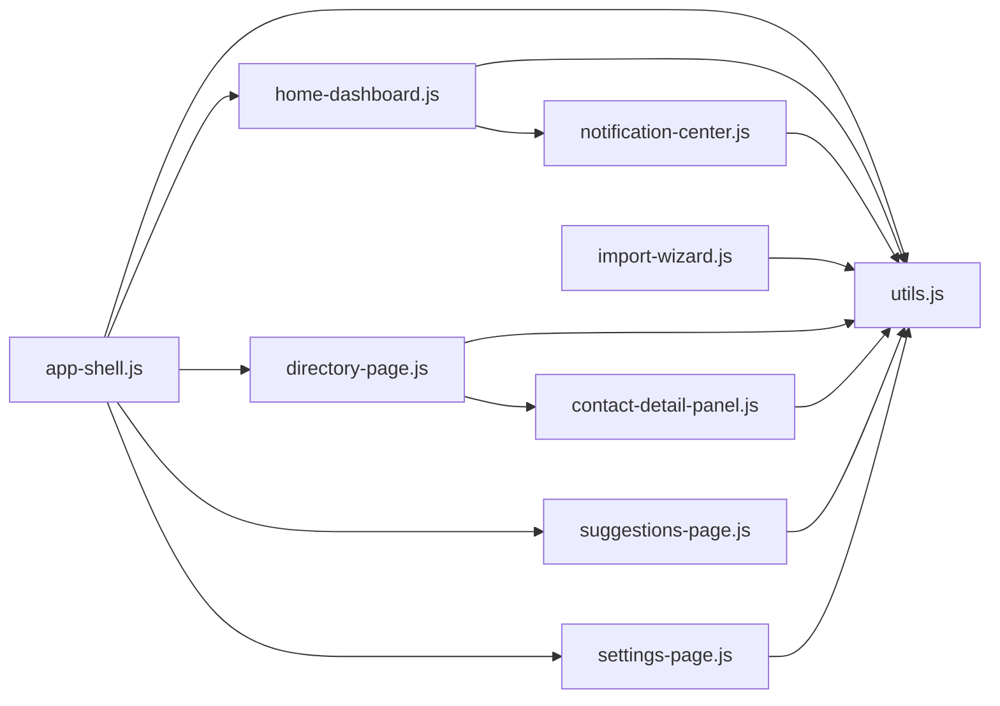
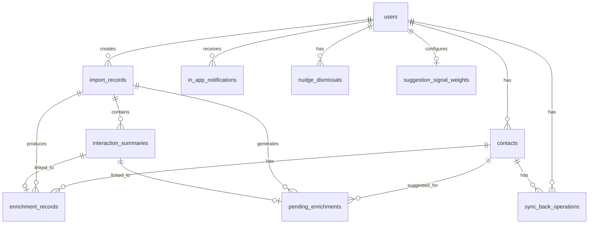

# Design Document: V1 Contact Enrichment Redesign

## Overview

This design covers the complete v1 redesign of CatchUp from a broad relationship management tool into a focused contact enrichment and relationship intelligence platform. The redesign spans 27 requirements across seven workstreams:

1. **UX Foundation** (Reqs 1–4): Landing page, progressive onboarding, home dashboard, enrichment columns
2. **Chat Import Pipeline** (Reqs 5–8, 24): Import wizard, platform parsers, tiered matching, pending enrichment queue
3. **Contact Detail & Enrichment** (Reqs 9–10): Slide-out panel, enrichment display, multi-source aggregation
4. **Import Lifecycle** (Reqs 11–12): Progress tracking, import history, data management
5. **External Sync** (Reqs 13–14): Google sync-back with user review, Apple vCard import/export
6. **Contact Management & AI** (Reqs 15–18): Archival, bulk ops, AI suggestion enrichment signals, multi-source tracking
7. **Codebase Cleanup & Infrastructure** (Reqs 19–23, 25–27): Module removal, auth fix, calendar streamlining, settings, notifications, frontend modularization

The system retains the existing Express.js 5 + TypeScript backend, PostgreSQL database, Upstash Redis cache, Google Cloud Tasks job processing, and Vanilla JS frontend with the Stone & Clay design system.

## Architecture

### High-Level System Architecture



### Request Flow for Chat Import



## Components and Interfaces

### Backend Services

#### 1. Chat History Parser (`src/chat-import/`)

```typescript
// src/chat-import/parser.ts
interface ParseResult {
  platform: ChatPlatform;
  participants: Participant[];
  messages: ParsedMessage[];
  errors: ParseError[];
}

interface Participant {
  identifier: string;        // phone, username, or email
  identifierType: 'phone' | 'email' | 'username' | 'display_name';
  displayName?: string;
  messageCount: number;
  firstMessageDate: Date;
  lastMessageDate: Date;
}

interface ParsedMessage {
  sender: string;            // participant identifier
  content: string;
  timestamp: Date;
  isSystemMessage: boolean;
}

interface ParseError {
  line?: number;
  entry?: number;
  message: string;
  raw?: string;
}

type ChatPlatform = 'whatsapp' | 'instagram' | 'imessage' | 'facebook' | 'twitter' | 'google_messages';

interface ChatParser {
  parse(stream: ReadableStream, platform: ChatPlatform): Promise<ParseResult>;
  detectPlatform(fileName: string, headerBytes: Buffer): ChatPlatform | null;
}
```

#### 2. Contact Matching Engine (`src/chat-import/matching.ts`)

```typescript
type MatchTier = 'auto' | 'likely' | 'unmatched';

interface ContactMatch {
  participant: Participant;
  contactId: string | null;
  contactName: string | null;
  confidence: number;         // 0.0–1.0
  tier: MatchTier;
  matchReason: string;        // e.g., "Phone exact match (E.164)"
}

interface MatchingEngine {
  matchParticipants(
    userId: string,
    participants: Participant[]
  ): Promise<ContactMatch[]>;
}
```

#### 3. Interaction Summary & Enrichment (`src/chat-import/enrichment.ts`)

```typescript
interface InteractionSummary {
  id: string;
  importRecordId: string;
  participantIdentifier: string;
  platform: ChatPlatform;
  messageCount: number;
  firstMessageDate: Date;
  lastMessageDate: Date;
  avgMessagesPerMonth: number;
  topics: string[];           // populated by AI enrichment job
  sentiment: 'positive' | 'neutral' | 'negative' | null;
  createdAt: Date;
}

interface EnrichmentRecord {
  id: string;
  contactId: string;
  userId: string;
  importRecordId: string;
  platform: ChatPlatform;
  messageCount: number;
  firstMessageDate: Date;
  lastMessageDate: Date;
  avgMessagesPerMonth: number;
  topics: string[];           // JSONB
  sentiment: 'positive' | 'neutral' | 'negative' | null;
  rawDataReference: string;   // SHA-256 hash of source file
  importedAt: Date;
}
```

#### 4. Google Sync-Back Service (`src/integrations/google-sync-back-service.ts`)

```typescript
type SyncBackStatus = 'pending_review' | 'approved' | 'syncing' | 'synced' | 'conflict' | 'failed';

interface SyncBackOperation {
  id: string;
  userId: string;
  contactId: string;
  field: string;              // 'name' | 'phone' | 'email' | 'customNotes'
  previousValue: string | null;
  newValue: string | null;
  status: SyncBackStatus;
  googleEtag?: string;
  conflictGoogleValue?: string;
  createdAt: Date;
  resolvedAt?: Date;
}

interface GoogleSyncBackService {
  createSyncBackOperation(userId: string, contactId: string, field: string, prevValue: string | null, newValue: string | null): Promise<SyncBackOperation>;
  getPendingOperations(userId: string): Promise<SyncBackOperation[]>;
  approveOperations(userId: string, operationIds: string[]): Promise<void>;
  skipOperations(userId: string, operationIds: string[]): Promise<void>;
  undoOperation(userId: string, operationId: string): Promise<void>;
  handleConflict(userId: string, operationId: string): Promise<SyncBackOperation>;
}
```

#### 5. Apple Contacts Service (`src/contacts/apple-contacts-service.ts`)

```typescript
interface VCardContact {
  fullName: string;
  firstName?: string;
  lastName?: string;
  phones: Array<{ type: string; value: string }>;
  emails: Array<{ type: string; value: string }>;
  organization?: string;
  address?: string;
  socialProfiles: Array<{ type: string; value: string }>;
  notes?: string;
}

interface AppleContactsService {
  parseVCard(fileContent: string): Promise<{ contacts: VCardContact[]; errors: ParseError[] }>;
  printVCard(contacts: Contact[]): string;
  importVCard(userId: string, fileContent: string): Promise<ImportResult>;
  exportToVCard(userId: string, contactIds?: string[]): Promise<string>;
}
```

#### 6. In-App Notification Service (`src/notifications/in-app-notification-service.ts`)

```typescript
type NotificationEventType =
  | 'import_complete' | 'import_failed'
  | 'ai_enrichment_ready' | 'export_reminder'
  | 'sync_conflict' | 'pending_enrichments_reminder';

interface InAppNotification {
  id: string;
  userId: string;
  eventType: NotificationEventType;
  title: string;
  description: string;
  actionUrl?: string;
  read: boolean;
  createdAt: Date;
}

// Delivery channel abstraction for future email/push
interface NotificationChannel {
  send(userId: string, notification: InAppNotification): Promise<void>;
}

interface InAppNotificationService {
  create(userId: string, eventType: NotificationEventType, title: string, description: string, actionUrl?: string): Promise<InAppNotification>;
  getUnread(userId: string): Promise<InAppNotification[]>;
  getAll(userId: string, limit?: number, offset?: number): Promise<InAppNotification[]>;
  markAsRead(userId: string, notificationId: string): Promise<void>;
  markAllAsRead(userId: string): Promise<void>;
  getUnreadCount(userId: string): Promise<number>;
  deleteOlderThan(days: number): Promise<number>;
}
```

#### 7. AI Suggestion Engine Updates (`src/matching/suggestion-service.ts`)

```typescript
// Configurable signal weights (stored in DB config table)
interface SuggestionSignalWeights {
  enrichmentData: number;     // default 0.25
  interactionLogs: number;    // default 0.35
  calendarData: number;       // default 0.25
  contactMetadata: number;    // default 0.15
}

interface EnrichmentSignal {
  contactId: string;
  avgMessagesPerMonth: number;
  lastMessageDate: Date;
  sentimentTrend: 'positive' | 'neutral' | 'negative' | null;
  frequencyTrend: 'increasing' | 'stable' | 'declining';
  topPlatform: ChatPlatform;
  totalMessageCount: number;
}
```

### Frontend Modules

#### Module Dependency Graph



#### `app-shell.js` — Core Application Shell

```javascript
// Owns: sidebar nav, page routing, auth state, theme, global utilities
export function initAppShell() { /* ... */ }
export function navigateTo(page) { /* ... */ }
export function getCurrentUser() { /* ... */ }
export function getAuthToken() { /* ... */ }
```

#### `utils.js` — Shared Utilities

```javascript
export function escapeHtml(str) { /* ... */ }
export function formatDateTime(date) { /* ... */ }
export function formatRelativeTime(date) { /* ... */ }
export async function fetchWithAuth(url, options) { /* ... */ }
export function showToast(message, type) { /* ... */ }
export function showConfirm(message) { /* ... */ }
```

### API Endpoints

#### New Routes

| Method | Path | Auth | Description | Req |
|--------|------|------|-------------|-----|
| GET | `/api/dashboard` | JWT | Home dashboard data (action items, insights, quick actions) | 3 |
| POST | `/api/imports/upload` | JWT | Upload chat export file, returns jobId | 5, 11 |
| GET | `/api/imports/:jobId/status` | JWT | Poll import job progress | 11 |
| GET | `/api/imports/history` | JWT | List import records | 12 |
| DELETE | `/api/imports/:importId` | JWT | Delete import and associated enrichment data | 12 |
| POST | `/api/imports/:importId/reimport` | JWT | Re-import with new file | 12 |
| GET | `/api/imports/:importId/matches` | JWT | Get likely matches for review | 7 |
| POST | `/api/imports/matches/:matchId/confirm` | JWT | Confirm a likely match | 7 |
| POST | `/api/imports/matches/:matchId/reject` | JWT | Reject a likely match | 7 |
| POST | `/api/imports/matches/:matchId/skip` | JWT | Skip a match for later | 7 |
| GET | `/api/enrichments/pending` | JWT | Get pending enrichment queue | 8 |
| POST | `/api/enrichments/pending/:id/link` | JWT | Link pending enrichment to contact | 8 |
| POST | `/api/enrichments/pending/:id/create-contact` | JWT | Create contact from pending enrichment | 8 |
| POST | `/api/enrichments/pending/:id/dismiss` | JWT | Dismiss pending enrichment | 8 |
| GET | `/api/contacts/:id/enrichments` | JWT | Get enrichment records for a contact | 10 |
| DELETE | `/api/contacts/:id/enrichments/:enrichmentId` | JWT | Delete an enrichment record | 10 |
| GET | `/api/sync-back/pending` | JWT | Get pending sync-back operations | 13 |
| POST | `/api/sync-back/approve` | JWT | Approve sync-back operations | 13 |
| POST | `/api/sync-back/skip` | JWT | Skip sync-back operations | 13 |
| POST | `/api/sync-back/:id/undo` | JWT | Undo a synced operation | 13 |
| POST | `/api/contacts/import-vcard` | JWT | Import contacts from vCard file | 14 |
| GET | `/api/contacts/export-vcard` | JWT | Export contacts to vCard format | 14 |
| POST | `/api/contacts/bulk` | JWT | Bulk operations (archive, tag, group, circle) | 16 |
| GET | `/api/notifications` | JWT | Get notifications (paginated) | 26 |
| GET | `/api/notifications/unread-count` | JWT | Get unread notification count | 26 |
| POST | `/api/notifications/:id/read` | JWT | Mark notification as read | 26 |
| POST | `/api/notifications/mark-all-read` | JWT | Mark all as read | 26 |
| GET | `/api/settings` | JWT | Get all user settings | 25 |
| PUT | `/api/settings` | JWT | Update user settings | 25 |
| GET | `/api/suggestion-weights` | JWT | Get current AI signal weights | 17 |
| PUT | `/api/suggestion-weights` | JWT | Update AI signal weights (admin) | 17 |

#### Removed Routes (Reqs 19–20, 23)

- All `/api/scheduling/*` routes
- All `/api/sms/*` routes
- `/api/twilio/test`
- `/api/user/phone-number`
- Calendar browsing/availability/feed routes (retain sync + OAuth routes)
- `/availability/:token` public page


## Data Models

### Database Schema Changes

#### 1. Modify `contacts` table — Source Migration (Req 18)

```sql
-- Migrate source from single string to sources array
ALTER TABLE contacts ADD COLUMN sources TEXT[] DEFAULT '{}';

-- Migration: copy existing source values into sources array
UPDATE contacts SET sources = ARRAY[source] WHERE source IS NOT NULL;

-- After migration verified, drop old column
-- ALTER TABLE contacts DROP COLUMN source;
```

#### 2. New table: `import_records` (Reqs 11, 12)

```sql
CREATE TABLE import_records (
  id UUID PRIMARY KEY DEFAULT gen_random_uuid(),
  user_id UUID NOT NULL REFERENCES users(id) ON DELETE CASCADE,
  platform VARCHAR(20) NOT NULL,  -- whatsapp, instagram, imessage, facebook, twitter, google_messages
  file_name VARCHAR(255) NOT NULL,
  file_hash VARCHAR(64) NOT NULL, -- SHA-256 for dedup
  status VARCHAR(20) NOT NULL DEFAULT 'processing',  -- processing, parsed, enriching, complete, failed
  failed_phase VARCHAR(20),       -- parsing, extracting, matching (if failed)
  error_message TEXT,
  total_participants INT DEFAULT 0,
  auto_matched INT DEFAULT 0,
  likely_matched INT DEFAULT 0,
  unmatched INT DEFAULT 0,
  enrichment_records_created INT DEFAULT 0,
  created_at TIMESTAMPTZ NOT NULL DEFAULT NOW(),
  completed_at TIMESTAMPTZ,
  CONSTRAINT import_records_status_check CHECK (status IN ('processing', 'parsed', 'enriching', 'complete', 'failed'))
);

CREATE INDEX idx_import_records_user_id ON import_records(user_id);
CREATE INDEX idx_import_records_user_status ON import_records(user_id, status);
```

#### 3. New table: `interaction_summaries` (Req 6)

```sql
CREATE TABLE interaction_summaries (
  id UUID PRIMARY KEY DEFAULT gen_random_uuid(),
  import_record_id UUID NOT NULL REFERENCES import_records(id) ON DELETE CASCADE,
  participant_identifier VARCHAR(255) NOT NULL,
  participant_display_name VARCHAR(255),
  identifier_type VARCHAR(20) NOT NULL, -- phone, email, username, display_name
  platform VARCHAR(20) NOT NULL,
  message_count INT NOT NULL DEFAULT 0,
  first_message_date TIMESTAMPTZ NOT NULL,
  last_message_date TIMESTAMPTZ NOT NULL,
  avg_messages_per_month NUMERIC(10,2) DEFAULT 0,
  topics JSONB DEFAULT '[]',
  sentiment VARCHAR(10),  -- positive, neutral, negative
  ai_enrichment_status VARCHAR(20) DEFAULT 'pending', -- pending, processing, complete, failed
  created_at TIMESTAMPTZ NOT NULL DEFAULT NOW()
);

CREATE INDEX idx_interaction_summaries_import ON interaction_summaries(import_record_id);
CREATE INDEX idx_interaction_summaries_participant ON interaction_summaries(participant_identifier);
```

#### 4. New table: `enrichment_records` (Req 10)

```sql
CREATE TABLE enrichment_records (
  id UUID PRIMARY KEY DEFAULT gen_random_uuid(),
  contact_id UUID NOT NULL REFERENCES contacts(id) ON DELETE CASCADE,
  user_id UUID NOT NULL REFERENCES users(id) ON DELETE CASCADE,
  import_record_id UUID REFERENCES import_records(id) ON DELETE SET NULL,
  interaction_summary_id UUID REFERENCES interaction_summaries(id) ON DELETE SET NULL,
  platform VARCHAR(20) NOT NULL,
  message_count INT NOT NULL DEFAULT 0,
  first_message_date TIMESTAMPTZ,
  last_message_date TIMESTAMPTZ,
  avg_messages_per_month NUMERIC(10,2) DEFAULT 0,
  topics JSONB DEFAULT '[]',
  sentiment VARCHAR(10),
  raw_data_reference VARCHAR(64), -- SHA-256 hash of source file
  imported_at TIMESTAMPTZ NOT NULL DEFAULT NOW()
);

CREATE INDEX idx_enrichment_records_contact ON enrichment_records(contact_id);
CREATE INDEX idx_enrichment_records_user ON enrichment_records(user_id);
CREATE INDEX idx_enrichment_records_import ON enrichment_records(import_record_id);
```

#### 5. New table: `pending_enrichments` (Reqs 7, 8)

```sql
CREATE TABLE pending_enrichments (
  id UUID PRIMARY KEY DEFAULT gen_random_uuid(),
  user_id UUID NOT NULL REFERENCES users(id) ON DELETE CASCADE,
  import_record_id UUID NOT NULL REFERENCES import_records(id) ON DELETE CASCADE,
  interaction_summary_id UUID NOT NULL REFERENCES interaction_summaries(id) ON DELETE CASCADE,
  participant_identifier VARCHAR(255) NOT NULL,
  participant_display_name VARCHAR(255),
  platform VARCHAR(20) NOT NULL,
  match_tier VARCHAR(10) NOT NULL, -- likely, unmatched
  suggested_contact_id UUID REFERENCES contacts(id) ON DELETE SET NULL,
  confidence NUMERIC(4,3),
  match_reason VARCHAR(255),
  status VARCHAR(20) NOT NULL DEFAULT 'pending', -- pending, linked, created, dismissed
  message_count INT DEFAULT 0,
  first_message_date TIMESTAMPTZ,
  last_message_date TIMESTAMPTZ,
  created_at TIMESTAMPTZ NOT NULL DEFAULT NOW(),
  resolved_at TIMESTAMPTZ
);

CREATE INDEX idx_pending_enrichments_user ON pending_enrichments(user_id);
CREATE INDEX idx_pending_enrichments_user_status ON pending_enrichments(user_id, status);
CREATE INDEX idx_pending_enrichments_import ON pending_enrichments(import_record_id);
```

#### 6. New table: `sync_back_operations` (Req 13)

```sql
CREATE TABLE sync_back_operations (
  id UUID PRIMARY KEY DEFAULT gen_random_uuid(),
  user_id UUID NOT NULL REFERENCES users(id) ON DELETE CASCADE,
  contact_id UUID NOT NULL REFERENCES contacts(id) ON DELETE CASCADE,
  field VARCHAR(50) NOT NULL,
  previous_value TEXT,
  new_value TEXT,
  status VARCHAR(20) NOT NULL DEFAULT 'pending_review',
  google_etag VARCHAR(255),
  conflict_google_value TEXT,
  created_at TIMESTAMPTZ NOT NULL DEFAULT NOW(),
  resolved_at TIMESTAMPTZ,
  CONSTRAINT sync_back_status_check CHECK (status IN ('pending_review', 'approved', 'syncing', 'synced', 'conflict', 'failed', 'skipped'))
);

CREATE INDEX idx_sync_back_user ON sync_back_operations(user_id);
CREATE INDEX idx_sync_back_user_status ON sync_back_operations(user_id, status);
CREATE INDEX idx_sync_back_contact ON sync_back_operations(contact_id);
```

#### 7. New table: `in_app_notifications` (Req 26)

```sql
CREATE TABLE in_app_notifications (
  id UUID PRIMARY KEY DEFAULT gen_random_uuid(),
  user_id UUID NOT NULL REFERENCES users(id) ON DELETE CASCADE,
  event_type VARCHAR(50) NOT NULL,
  title VARCHAR(255) NOT NULL,
  description TEXT,
  action_url VARCHAR(500),
  read BOOLEAN NOT NULL DEFAULT FALSE,
  created_at TIMESTAMPTZ NOT NULL DEFAULT NOW()
);

CREATE INDEX idx_notifications_user ON in_app_notifications(user_id);
CREATE INDEX idx_notifications_user_unread ON in_app_notifications(user_id, read) WHERE read = FALSE;
CREATE INDEX idx_notifications_created ON in_app_notifications(created_at);
```

#### 8. New table: `suggestion_signal_weights` (Req 17)

```sql
CREATE TABLE suggestion_signal_weights (
  id UUID PRIMARY KEY DEFAULT gen_random_uuid(),
  user_id UUID REFERENCES users(id) ON DELETE CASCADE, -- NULL = global defaults
  enrichment_data NUMERIC(4,3) NOT NULL DEFAULT 0.25,
  interaction_logs NUMERIC(4,3) NOT NULL DEFAULT 0.35,
  calendar_data NUMERIC(4,3) NOT NULL DEFAULT 0.25,
  contact_metadata NUMERIC(4,3) NOT NULL DEFAULT 0.15,
  updated_at TIMESTAMPTZ NOT NULL DEFAULT NOW(),
  CONSTRAINT weights_sum_check CHECK (
    enrichment_data + interaction_logs + calendar_data + contact_metadata BETWEEN 0.99 AND 1.01
  )
);

-- Insert global defaults
INSERT INTO suggestion_signal_weights (enrichment_data, interaction_logs, calendar_data, contact_metadata)
VALUES (0.25, 0.35, 0.25, 0.15);
```

#### 9. New table: `nudge_dismissals` (Req 2)

```sql
CREATE TABLE nudge_dismissals (
  id UUID PRIMARY KEY DEFAULT gen_random_uuid(),
  user_id UUID NOT NULL REFERENCES users(id) ON DELETE CASCADE,
  nudge_type VARCHAR(50) NOT NULL, -- organize_circles, set_frequency, import_more, get_deeper_insights
  dismissed_at TIMESTAMPTZ NOT NULL DEFAULT NOW(),
  show_again_after TIMESTAMPTZ NOT NULL, -- dismissed_at + 7 days
  UNIQUE(user_id, nudge_type)
);
```

### Entity Relationship Diagram




## Correctness Properties

*A property is a characteristic or behavior that should hold true across all valid executions of a system — essentially, a formal statement about what the system should do. Properties serve as the bridge between human-readable specifications and machine-verifiable correctness guarantees.*

### Property 1: Nudge dismissal respects 7-day cooldown

*For any* nudge type and any user, if the nudge is dismissed, querying visible nudges within 7 days of dismissal should not include that nudge type. Querying after 7 days should include it again.

**Validates: Requirements 2.5**

### Property 2: Dashboard action item counts are accurate

*For any* user with a set of pending enrichments, pending sync-back operations, active import jobs, and pending likely matches, the dashboard API should return counts that exactly match the respective database counts for that user.

**Validates: Requirements 3.2**

### Property 3: Relationship health indicator is deterministic

*For any* contact with a frequency preference and a last interaction date, the health indicator should be computed deterministically: green if last interaction is within the frequency window, yellow if within 1.5× the window, red if beyond 1.5×, and gray if no frequency preference or no interaction data exists.

**Validates: Requirements 4.2**

### Property 4: Relative time formatting is correct

*For any* Date value, the formatRelativeTime function should produce a non-empty string that accurately represents the time difference from now (e.g., "3 days ago", "2 months ago", "just now").

**Validates: Requirements 4.1**

### Property 5: Contact source badges match sources array

*For any* contact, the set of source badges displayed should exactly equal the contact's `sources` array. No extra badges, no missing badges.

**Validates: Requirements 4.3, 9.5, 18.4**

### Property 6: Contacts table sorting by last interaction

*For any* list of contacts sorted by "Last Interaction" ascending, each contact's last interaction date should be ≤ the next contact's last interaction date. The inverse for descending.

**Validates: Requirements 4.6**

### Property 7: Platform auto-detection from file signatures

*For any* valid chat export file with a known platform signature (WhatsApp text patterns, Instagram JSON schema, Facebook JSON schema, Twitter JSON schema, SMS Backup XML root element, iMessage CSV headers), the `detectPlatform` function should return the correct platform identifier.

**Validates: Requirements 5.5**

### Property 8: Parser produces one InteractionSummary per unique participant

*For any* valid chat export file, parsing should produce exactly one InteractionSummary per unique participant identifier, where each summary's messageCount equals the actual count of messages from that participant, and firstMessageDate ≤ lastMessageDate.

**Validates: Requirements 6.1**

### Property 9: Participant identifier normalization

*For any* phone number string, normalization should produce a valid E.164 format string. *For any* email address or username string, normalization should produce a lowercase string.

**Validates: Requirements 6.4**

### Property 10: InteractionSummary JSON round-trip

*For any* valid InteractionSummary object, serializing to JSON then deserializing should produce an equivalent InteractionSummary with all fields preserved.

**Validates: Requirements 6.5**

### Property 11: Tiered matching threshold classification

*For any* participant with a computed confidence score, the match tier should be: 'auto' if confidence ≥ 0.7, 'likely' if 0.5 ≤ confidence < 0.7, 'unmatched' if confidence < 0.5. No participant should be assigned to a tier inconsistent with its confidence score.

**Validates: Requirements 7.1**

### Property 12: Unmatched participants sorted by message frequency

*For any* set of unmatched participants from an import, the pending enrichment queue should return them sorted by message count descending.

**Validates: Requirements 7.3**

### Property 13: High-frequency unmatched participants get smart suggestion

*For any* import with unmatched participants, those in the top 20% by message count should have a smart suggestion flag set to true.

**Validates: Requirements 7.4**

### Property 14: Confirmed match creates enrichment record

*For any* confirmed contact match (auto or user-confirmed), an enrichment record should exist linking the interaction summary to the matched contact, with the correct platform and message statistics.

**Validates: Requirements 7.6**

### Property 15: JWT authentication on all import/matching endpoints

*For any* API endpoint under `/api/imports/` or `/api/enrichments/`, a request without a valid JWT Bearer token should return HTTP 401.

**Validates: Requirements 7.7, 22.5**

### Property 16: Pending enrichment grouping by import

*For any* set of pending enrichments belonging to multiple imports, grouping by import_record_id should produce groups where every item in a group shares the same import_record_id and platform.

**Validates: Requirements 8.1**

### Property 17: Create contact from pending enrichment pre-populates fields

*For any* pending enrichment with a participant identifier and display name, creating a contact from it should produce a contact whose name matches the display name and whose relevant identifier field (phone/email/social handle) matches the participant identifier.

**Validates: Requirements 8.4**

### Property 18: Dismissed pending enrichments hidden from default view

*For any* pending enrichment marked as dismissed, querying pending enrichments with the default filter (status = 'pending') should not include it.

**Validates: Requirements 8.5**

### Property 19: Pending enrichment badge count accuracy

*For any* user, the pending enrichment badge count should equal the count of pending_enrichments with status = 'pending' for that user.

**Validates: Requirements 8.6**

### Property 20: Enrichment record aggregation across platforms

*For any* contact with enrichment records from N different platforms, the aggregated view should: sum total message counts across all records, use the most recent lastMessageDate as the overall last interaction, and produce exactly N per-platform breakdown entries.

**Validates: Requirements 9.3, 9.4, 10.2**

### Property 21: lastContactDate reflects most recent interaction across all sources

*For any* contact, the lastContactDate should equal the maximum of: all enrichment record lastMessageDates, all calendar meeting dates, and any manually logged interaction dates. When an enrichment record or calendar event is added with a more recent date, lastContactDate should update. When the most recent source is deleted, lastContactDate should revert to the next most recent.

**Validates: Requirements 10.3, 10.5, 23.9**

### Property 22: Import completion statistics are consistent

*For any* completed import, the sum of auto_matched + likely_matched + unmatched should equal total_participants.

**Validates: Requirements 11.3**

### Property 23: Maximum 3 concurrent imports per user

*For any* user with 3 import records in 'processing' status, attempting to create a 4th import should be rejected with an appropriate error.

**Validates: Requirements 11.6**

### Property 24: Import history sorted by date descending

*For any* user's import history, the records should be returned sorted by created_at descending — each record's created_at should be ≥ the next record's created_at.

**Validates: Requirements 12.1**

### Property 25: Import deletion cascades correctly

*For any* import deletion, all enrichment_records and pending_enrichments with that import_record_id should be removed, and affected contacts' lastContactDate should be recalculated from remaining sources.

**Validates: Requirements 12.4**

### Property 26: Raw message content not persisted

*For any* completed import, the raw_data_reference field should be a 64-character hexadecimal string (SHA-256 hash), and no interaction_summary or enrichment_record should contain raw message text content.

**Validates: Requirements 12.6**

### Property 27: Contact field edit creates sync-back operation

*For any* contact with a non-null googleResourceName, editing the name, phone, email, or customNotes field should create a sync_back_operation with status 'pending_review', the correct previous and new values, and the contact's current googleEtag.

**Validates: Requirements 13.1**

### Property 28: Sync-back operation count accuracy

*For any* user, the pending sync changes count should equal the count of sync_back_operations with status 'pending_review' for that user.

**Validates: Requirements 13.2**

### Property 29: Successful sync-back updates etag and timestamp

*For any* sync-back operation that completes successfully, the associated contact's googleEtag should be updated to the new value from Google, lastSyncedAt should be updated, and the operation status should be 'synced'.

**Validates: Requirements 13.7**

### Property 30: Sync-back undo restores previous value

*For any* synced sync-back operation, undoing it should restore the contact's field to the previous_value stored in the operation and mark the operation as reverted.

**Validates: Requirements 13.8**

### Property 31: vCard round-trip

*For any* valid Contact record, printing to vCard 4.0 format then parsing the output should produce a Contact record equivalent to the original (for the fields supported by vCard: name, phone, email, organization, address, social profiles, notes).

**Validates: Requirements 14.7**

### Property 32: Archive/restore round-trip

*For any* non-archived contact, archiving then restoring should result in the contact appearing in the default contact list with all original group and circle assignments intact and archived_at cleared.

**Validates: Requirements 15.2, 15.4**

### Property 33: Archived contacts excluded from default views

*For any* archived contact, it should not appear in: the default contact list query, suggestion generation input, or circle/group member lists.

**Validates: Requirements 15.2, 15.3**

### Property 34: Bulk operations apply atomically

*For any* set of up to 200 contact IDs and a bulk operation (archive, add tag, assign group, assign circle), after successful execution, every contact in the set should have the operation applied. If any contact fails, none should be modified (transaction rollback).

**Validates: Requirements 16.3, 16.4, 16.5, 16.6, 16.7**

### Property 35: AI suggestion engine handles presence and absence of enrichment data

*For any* contact, the suggestion engine should produce a valid score between 0 and 100 using configurable signal weights. When enrichment data exists, the enrichment signal should contribute to the score proportional to its weight. When no enrichment data exists, the remaining signals should be re-weighted proportionally so the total score is still valid.

**Validates: Requirements 17.1, 17.5**

### Property 36: Declining frequency increases suggestion priority

*For any* two contacts where contact A has a declining communication frequency (current month avg < 50% of 6-month avg) and contact B has stable frequency, and all other signals are equal, contact A's suggestion priority score should be higher than contact B's.

**Validates: Requirements 17.2**

### Property 37: Negative sentiment included in reasoning

*For any* suggestion where the associated contact has a negative sentiment trend from enrichment data, the suggestion reasoning text should contain a reference to sentiment.

**Validates: Requirements 17.3**

### Property 38: Signal weights sum to 1.0

*For any* set of suggestion signal weights stored in the database, the sum of enrichment_data + interaction_logs + calendar_data + contact_metadata should be between 0.99 and 1.01 (floating point tolerance).

**Validates: Requirements 17.4**

### Property 39: Source array updated on enrichment

*For any* contact enriched from a chat import, 'chat_import' should be present in the sources array. *For any* contact imported from Apple vCard, 'apple' should be present. Sources should never contain duplicates.

**Validates: Requirements 18.2, 18.3**

### Property 40: Contact filtering by source

*For any* source value and any user, filtering contacts by that source should return exactly the contacts whose sources array contains that value.

**Validates: Requirements 18.5**

### Property 41: Platform parsers produce valid ParseResult

*For any* supported platform (WhatsApp, Instagram, iMessage, Facebook, Twitter, Google Messages) and any valid export file for that platform, the parser should produce a ParseResult with: the correct platform identifier, a non-empty participants array, a messages array where each message has a valid timestamp and sender, and an errors array (possibly empty).

**Validates: Requirements 24.1, 24.2, 24.3, 24.4, 24.5, 24.6, 24.7**

### Property 42: Parser graceful degradation

*For any* chat export input containing a mix of valid and invalid entries, the parser should extract all valid entries into the messages array and report all invalid entries in the errors array, without failing the entire parse.

**Validates: Requirements 24.8**

### Property 43: ParseResult JSON round-trip

*For any* valid ParseResult object, `JSON.parse(JSON.stringify(parseResult))` should produce an equivalent ParseResult with all fields preserved (accounting for Date serialization to ISO strings).

**Validates: Requirements 24.10**

### Property 44: Timezone search returns matching results

*For any* city name or timezone identifier present in the timezone dataset, searching should return at least one matching result containing that city or timezone.

**Validates: Requirements 25.4**

### Property 45: Notification unread count accuracy

*For any* user, the unread notification count should equal the count of in_app_notifications where read = false for that user.

**Validates: Requirements 26.1**

### Property 46: Notifications sorted by timestamp descending

*For any* user's notification list, each notification's created_at should be ≥ the next notification's created_at.

**Validates: Requirements 26.2**

### Property 47: Mark all as read sets all to read

*For any* user with N unread notifications, after calling markAllAsRead, the unread count should be 0 and all N notifications should have read = true.

**Validates: Requirements 26.6**

### Property 48: Auto-delete notifications older than 30 days

*For any* notification with created_at older than 30 days, after the cleanup job runs, that notification should no longer exist in the database.

**Validates: Requirements 26.7**


## Error Handling

### Chat Import Pipeline Errors

| Error Scenario | Handling Strategy | User Feedback |
|---|---|---|
| File exceeds 200MB | Reject at upload middleware before processing | "File too large. Maximum size is 200MB." |
| Unsupported file format | detectPlatform returns null, reject with format hint | "Unrecognized format. Expected [format] for [platform]." |
| Parse failure (corrupt file) | Parser catches, logs error, marks import as failed with phase | "Import failed during parsing. [Retry]" |
| Partial parse (some entries invalid) | Parser adds to errors array, continues processing valid entries | Import completes with warning: "N entries could not be parsed" |
| AI enrichment job failure | Retry up to 3 times via Cloud Tasks retry config; mark as failed after exhaustion | "AI analysis failed. Enrichment data may be incomplete." notification |
| Concurrent import limit (>3) | Reject at API layer before creating import record | "You have 3 imports in progress. Please wait for one to complete." |
| File deduplication (same hash) | Detect at upload, warn user, offer to replace or cancel | "This file was already imported on [date]. Replace previous import?" |

### Google Sync-Back Errors

| Error Scenario | Handling Strategy | User Feedback |
|---|---|---|
| 409 Conflict (etag mismatch) | Fetch latest from Google, update diff, set status to 'conflict' | "Google value changed since your edit. Please re-review." |
| 401/403 (token expired/insufficient scope) | Trigger incremental auth prompt for read-write scope | "Additional permissions needed to sync changes to Google." |
| 429 Rate limit | Exponential backoff via Cloud Tasks retry; re-enqueue | Silent retry; notification only if exhausted |
| Network failure | Cloud Tasks automatic retry (up to 5 attempts) | Notification after all retries exhausted |
| Partial batch failure | Each operation is independent; failed ones marked, successful ones committed | "3 of 5 changes synced. 2 failed — [Review]" |

### vCard Import Errors

| Error Scenario | Handling Strategy | User Feedback |
|---|---|---|
| Malformed vCard entry | Skip entry, add to errors array, continue parsing | "N contacts imported, M entries skipped (malformed)" |
| Unsupported vCard version | Attempt best-effort parse; warn if fields missing | "Some fields may not have imported correctly from this vCard version" |
| Empty file | Reject with descriptive error | "The uploaded file contains no contacts." |

### Bulk Operation Errors

| Error Scenario | Handling Strategy | User Feedback |
|---|---|---|
| Exceeds 200 contact limit | Reject at API validation | "Maximum 200 contacts per bulk operation." |
| Partial failure in transaction | Roll back entire transaction | "Operation failed. No contacts were modified. [Error details]" |
| Contact not found in batch | Include in error response, roll back all | "Contact [name] not found. No changes applied." |

### General API Error Handling

- All API routes use the existing Express error middleware (`errorHandler` in server.ts)
- Validation errors return 400 with descriptive messages
- Authentication failures return 401
- Authorization failures return 403
- Not found returns 404
- Rate limiting returns 429 with Retry-After header
- Internal errors return 500 with generic message (details logged server-side)
- All errors include a `code` field for programmatic handling (e.g., `IMPORT_LIMIT_EXCEEDED`, `SYNC_CONFLICT`, `FILE_TOO_LARGE`)

## Testing Strategy

### Testing Framework

- **Unit tests**: Vitest (`npm test`)
- **Property-based tests**: fast-check via Vitest
- **Type checking**: `npm run typecheck`
- **Manual UI tests**: HTML test files in `tests/html/`

### Unit Testing Focus

Unit tests should cover specific examples, edge cases, and integration points:

- **Chat parsers**: Known-good sample files for each platform (WhatsApp, Instagram, iMessage, Facebook, Twitter, Google Messages) with expected output assertions
- **vCard parser/printer**: Sample vCard 3.0 and 4.0 files with known fields
- **Matching engine**: Specific matching scenarios (exact phone match, fuzzy name match, no match)
- **Sync-back service**: Conflict resolution flow, undo flow
- **Notification service**: Event-to-notification mapping for each event type
- **Dashboard API**: Zero-state, partial-data, and full-data scenarios
- **Bulk operations**: Transaction rollback on failure, 200-contact limit enforcement
- **Edge cases**: Empty files, oversized files, malformed entries, concurrent import limits

### Property-Based Testing Configuration

- Library: `fast-check`
- Minimum iterations: 100 per property test (`{ numRuns: 100 }`)
- Each property test must reference its design document property via comment tag
- Tag format: `Feature: 032-v1-contact-enrichment-redesign, Property {number}: {title}`

### Property Test Groupings

#### Chat Import & Parsing (Properties 7–10, 41–43)

```typescript
// Feature: 032-v1-contact-enrichment-redesign, Property 10: InteractionSummary JSON round-trip
fc.assert(fc.property(interactionSummaryArb, (summary) => {
  const serialized = JSON.stringify(summary);
  const deserialized = JSON.parse(serialized);
  expect(deserializeInteractionSummary(deserialized)).toEqual(summary);
}), { numRuns: 100 });
```

Key generators needed:
- `interactionSummaryArb`: generates valid InteractionSummary objects with random platforms, dates, message counts
- `parseResultArb`: generates valid ParseResult objects with random participants and messages
- `chatExportArb(platform)`: generates valid chat export content for each platform
- `participantIdentifierArb`: generates phone numbers, emails, usernames

#### Contact Matching (Properties 11–14)

```typescript
// Feature: 032-v1-contact-enrichment-redesign, Property 11: Tiered matching threshold classification
fc.assert(fc.property(fc.float({ min: 0, max: 1 }), (confidence) => {
  const tier = classifyTier(confidence);
  if (confidence >= 0.7) expect(tier).toBe('auto');
  else if (confidence >= 0.5) expect(tier).toBe('likely');
  else expect(tier).toBe('unmatched');
}), { numRuns: 100 });
```

#### Enrichment & Data Integrity (Properties 20–26)

Key generators needed:
- `enrichmentRecordArb`: generates enrichment records with random platforms, dates, message counts
- `contactWithEnrichmentsArb`: generates contacts with 1–5 enrichment records from different platforms

#### Sync-Back (Properties 27–30)

```typescript
// Feature: 032-v1-contact-enrichment-redesign, Property 30: Sync-back undo restores previous value
fc.assert(fc.property(contactFieldArb, fc.string(), fc.string(), (field, oldVal, newVal) => {
  // Create sync-back op, mark as synced, then undo
  // Assert contact field reverts to oldVal
}), { numRuns: 100 });
```

#### vCard (Property 31)

```typescript
// Feature: 032-v1-contact-enrichment-redesign, Property 31: vCard round-trip
fc.assert(fc.property(vCardContactArb, (contact) => {
  const vcard = printVCard(contact);
  const parsed = parseVCard(vcard);
  expect(parsed.contacts[0]).toMatchVCardFields(contact);
}), { numRuns: 100 });
```

Key generators needed:
- `vCardContactArb`: generates contacts with random names, phones, emails, orgs, addresses

#### Archival & Bulk Ops (Properties 32–34)

```typescript
// Feature: 032-v1-contact-enrichment-redesign, Property 34: Bulk operations apply atomically
fc.assert(fc.property(
  fc.array(fc.uuid(), { minLength: 1, maxLength: 200 }),
  fc.constantFrom('archive', 'tag', 'group', 'circle'),
  (contactIds, operation) => {
    // Execute bulk op, verify all contacts affected
  }
), { numRuns: 100 });
```

#### AI Suggestions (Properties 35–38)

```typescript
// Feature: 032-v1-contact-enrichment-redesign, Property 38: Signal weights sum to 1.0
fc.assert(fc.property(signalWeightsArb, (weights) => {
  const sum = weights.enrichmentData + weights.interactionLogs + weights.calendarData + weights.contactMetadata;
  expect(sum).toBeCloseTo(1.0, 2);
}), { numRuns: 100 });
```

#### Notifications (Properties 45–48)

```typescript
// Feature: 032-v1-contact-enrichment-redesign, Property 47: Mark all as read
fc.assert(fc.property(
  fc.array(notificationArb, { minLength: 1, maxLength: 50 }),
  (notifications) => {
    // Insert notifications, call markAllAsRead, verify unread count = 0
  }
), { numRuns: 100 });
```

### Test File Organization

Tests are co-located with source files per project convention:

| Source File | Test File |
|---|---|
| `src/chat-import/parser.ts` | `src/chat-import/parser.test.ts` |
| `src/chat-import/matching.ts` | `src/chat-import/matching.test.ts` |
| `src/chat-import/whatsapp-parser.ts` | `src/chat-import/whatsapp-parser.test.ts` |
| `src/chat-import/instagram-parser.ts` | `src/chat-import/instagram-parser.test.ts` |
| `src/contacts/apple-contacts-service.ts` | `src/contacts/apple-contacts-service.test.ts` |
| `src/integrations/google-sync-back-service.ts` | `src/integrations/google-sync-back-service.test.ts` |
| `src/notifications/in-app-notification-service.ts` | `src/notifications/in-app-notification-service.test.ts` |
| `src/matching/suggestion-service.ts` | `src/matching/suggestion-service.test.ts` (extend existing) |

### Manual UI Test Files

New HTML test files in `tests/html/`:

- `home-dashboard-test.html` — Dashboard layout, action items, nudge cards
- `import-wizard-test.html` — Platform selection, file upload, progress indicator
- `contact-detail-panel-test.html` — Slide-out panel, enrichment display, keyboard nav
- `notification-center-test.html` — Bell icon, notification list, mark as read
- `bulk-operations-test.html` — Multi-select, bulk action toolbar
- `sync-review-test.html` — Diff view, approve/skip, conflict display
