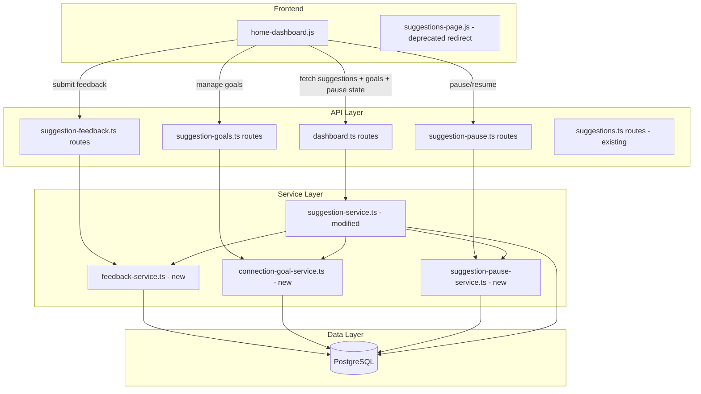
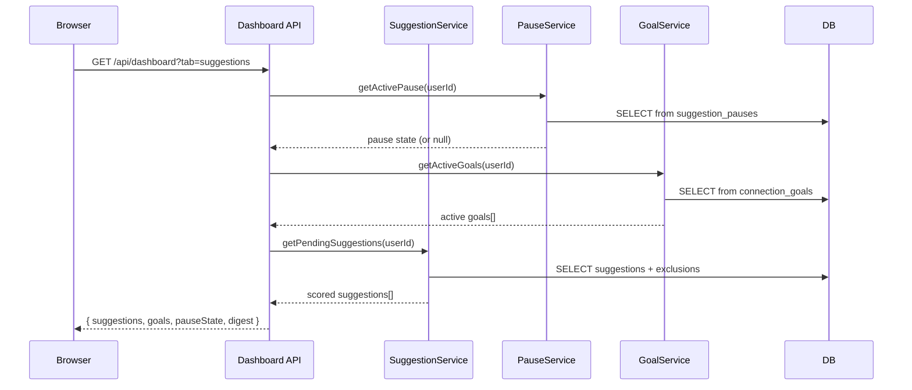

# Design Document: Smart Suggestions Redesign

## Overview

This design transforms the CatchUp suggestion experience from a standalone page (`suggestions-page.js`) into an integrated dashboard tab system with structured feedback, goal-aware scoring, pause/resume controls, conversation starters, post-interaction reviews, and a weekly digest. The redesign touches the full stack: new database tables, new backend services, modified API routes, and a reworked frontend rendering pipeline.

The core philosophy is quality over quantity — surface 3 well-explained suggestions with clear reasoning, actionable conversation starters, and a feedback loop that tunes the scoring algorithm over time.

### Key Design Decisions

1. **Tab integration over separate page**: Suggestions move into the dashboard as a tab, following the existing `switchDirectoryTab` pattern from `directory-page.js`. The old suggestions page will redirect to `#dashboard/suggestions`.
2. **Structured feedback replaces `prompt()`**: The current `dismissSuggestion` uses `prompt()` for free-text reasons. This is replaced with preset feedback options rendered inline on the card, with an optional free-text field for "Other".
3. **Feedback drives weight adjustment**: Aggregated feedback patterns trigger automatic signal weight adjustments via the existing `suggestion_signal_weights` table, bounded by min/max caps.
4. **Goal relevance as a 5th scoring signal**: When connection goals are active, `goalRelevance` is injected as a 5th signal with proportional redistribution of existing weights.
5. **Server-side conversation starters**: Generated in `suggestion-service.ts` using contact context (tags, enrichment topics, calendar events), not via a separate AI call for v1.
6. **Pause state checked at generation time**: The pause service is consulted during suggestion generation, not at display time, to avoid generating suggestions that won't be shown.

## Architecture



### Request Flow: Dashboard Suggestions Tab Load



## Components and Interfaces

### New Backend Services

#### FeedbackService (`src/matching/feedback-service.ts`)

```typescript
export interface FeedbackRecord {
  id: string;
  suggestionId: string;
  userId: string;
  preset: FeedbackPreset;
  comment?: string;
  createdAt: Date;
}

export type FeedbackPreset =
  | 'already_in_touch'
  | 'not_relevant'
  | 'timing_off'
  | 'dont_suggest_contact'
  | 'other';

export const VALID_PRESETS: FeedbackPreset[] = [
  'already_in_touch',
  'not_relevant',
  'timing_off',
  'dont_suggest_contact',
  'other',
];

export interface FeedbackSummary {
  preset: FeedbackPreset;
  count: number;
}

export interface ReviewRecord {
  id: string;
  suggestionId: string;
  userId: string;
  outcome: ReviewOutcome;
  createdAt: Date;
}

export type ReviewOutcome = 'went_well' | 'not_great' | 'not_yet' | 'skip';

export class FeedbackService {
  /** Persist feedback and dismiss the suggestion in one transaction. */
  async submitFeedback(
    suggestionId: string,
    userId: string,
    preset: FeedbackPreset,
    comment?: string
  ): Promise<FeedbackRecord>;

  /** Get aggregated feedback counts for a user. */
  async getFeedbackSummary(userId: string): Promise<FeedbackSummary[]>;

  /** Check feedback patterns and adjust signal weights if thresholds met. */
  async adjustWeightsFromFeedback(userId: string): Promise<void>;

  /** Submit a post-interaction review. */
  async submitReview(
    suggestionId: string,
    userId: string,
    outcome: ReviewOutcome
  ): Promise<ReviewRecord>;

  /** Get suggestions pending review (reviewPromptAfter has passed). */
  async getPendingReviews(userId: string): Promise<Array<{
    suggestionId: string;
    contactName: string;
    acceptedAt: Date;
  }>>;
}
```

#### ConnectionGoalService (`src/matching/connection-goal-service.ts`)

```typescript
export interface ConnectionGoal {
  id: string;
  userId: string;
  text: string;
  keywords: string[];
  status: 'active' | 'completed' | 'archived';
  createdAt: Date;
  updatedAt: Date;
}

export class ConnectionGoalService {
  /** Create a new goal, enforcing max 2 active goals. */
  async createGoal(userId: string, text: string): Promise<ConnectionGoal>;

  /** Get active goals for a user. */
  async getActiveGoals(userId: string): Promise<ConnectionGoal[]>;

  /** Archive a goal. */
  async archiveGoal(goalId: string, userId: string): Promise<void>;

  /** Extract keywords from goal text using simple NLP. */
  extractKeywords(text: string): string[];

  /** Compute goal relevance score (0-100) for a contact. */
  computeGoalRelevance(
    contact: Contact,
    goals: ConnectionGoal[]
  ): number;
}
```

#### SuggestionPauseService (`src/matching/suggestion-pause-service.ts`)

```typescript
export interface SuggestionPause {
  id: string;
  userId: string;
  pauseStart: Date;
  pauseEnd: Date;
  createdAt: Date;
}

export class SuggestionPauseService {
  /** Create a pause for 1-4 weeks. */
  async createPause(userId: string, weeks: number): Promise<SuggestionPause>;

  /** Get active pause (if any). Returns null if no active pause or expired. */
  async getActivePause(userId: string): Promise<SuggestionPause | null>;

  /** Resume early by deleting the active pause. */
  async resumeEarly(userId: string): Promise<void>;

  /** Check if suggestions are currently paused. */
  async isPaused(userId: string): Promise<boolean>;
}
```

### Modified Existing Services

#### SuggestionService (`src/matching/suggestion-service.ts`) — Modifications

- `computeWeightedScore`: Add optional `goalRelevance` 5th signal when goals are active. Redistribute existing 4 weights proportionally so all 5 sum to 1.0.
- `getPendingSuggestions`: Check pause state before returning. Return empty array if paused.
- New export: `generateConversationStarter(contact, suggestion, enrichment)` — returns a string.
- New export: `computeGoalAwareScore(contact, enrichment, weights, goals, currentDate)` — wraps `computeWeightedScore` with goal signal injection.
- API response shape: Add `signalContribution`, `conversationStarter`, and `goalRelevanceScore` fields to each suggestion.

#### Dashboard Routes (`src/api/routes/dashboard.ts`) — Modifications

- Augment `GET /api/dashboard` response with `suggestions`, `activeGoals`, `pauseState`, `pendingReviews`, and `weeklyDigest` fields when the suggestions tab data is requested.

### New API Routes

#### `src/api/routes/suggestion-feedback.ts`

| Method | Path | Description |
|--------|------|-------------|
| `POST` | `/api/suggestions/:id/feedback` | Submit feedback + dismiss suggestion |
| `GET` | `/api/suggestions/feedback/summary` | Aggregated feedback counts |
| `POST` | `/api/suggestions/:id/review` | Submit post-interaction review |
| `POST` | `/api/suggestions/dismiss-all` | Bulk dismiss all pending suggestions |

#### `src/api/routes/suggestion-goals.ts`

| Method | Path | Description |
|--------|------|-------------|
| `POST` | `/api/suggestions/goals` | Create a connection goal |
| `GET` | `/api/suggestions/goals` | Get active goals |
| `DELETE` | `/api/suggestions/goals/:goalId` | Archive a goal |

#### `src/api/routes/suggestion-pause.ts`

| Method | Path | Description |
|--------|------|-------------|
| `POST` | `/api/suggestions/pause` | Create a pause (1-4 weeks) |
| `GET` | `/api/suggestions/pause` | Get current pause state |
| `DELETE` | `/api/suggestions/pause` | Resume early |

#### `src/api/routes/suggestion-feedback.ts` — Exclusions

| Method | Path | Description |
|--------|------|-------------|
| `GET` | `/api/suggestions/exclusions` | List excluded contacts |
| `DELETE` | `/api/suggestions/exclusions/:contactId` | Remove exclusion |

### Frontend Changes (`public/js/home-dashboard.js`)

- Add tab bar rendering (`switchDashboardTab`) following the `switchDirectoryTab` pattern.
- Add `renderSuggestionsTab()` that renders: goal banner, pause banner, weekly digest, suggestion cards (max 3), "Show more" control, "Dismiss all" control, "Pause suggestions" control.
- Suggestion card rendering: avatar, name, reasoning summary, conversation starter (💬 italic), expandable signal details, action buttons ("Reach out", "Not now", "Snooze").
- "Not now" triggers inline preset feedback options instead of `prompt()`.
- Post-interaction review prompts rendered as lightweight banners.

### Frontend Deprecation (`public/js/suggestions-page.js`)

- The standalone suggestions page will redirect to `navigateTo('dashboard')` with hash `#dashboard/suggestions`.

## Data Models

### New Database Tables

#### `suggestion_feedback`

```sql
CREATE TABLE suggestion_feedback (
  id UUID PRIMARY KEY DEFAULT gen_random_uuid(),
  suggestion_id UUID NOT NULL REFERENCES suggestions(id) ON DELETE CASCADE,
  user_id UUID NOT NULL REFERENCES users(id) ON DELETE CASCADE,
  preset VARCHAR(50) NOT NULL CHECK (preset IN (
    'already_in_touch', 'not_relevant', 'timing_off', 'dont_suggest_contact', 'other'
  )),
  comment TEXT,
  created_at TIMESTAMPTZ NOT NULL DEFAULT NOW()
);

CREATE INDEX idx_suggestion_feedback_user ON suggestion_feedback(user_id);
CREATE INDEX idx_suggestion_feedback_preset ON suggestion_feedback(user_id, preset, created_at);
```

#### `suggestion_exclusions`

```sql
CREATE TABLE suggestion_exclusions (
  id UUID PRIMARY KEY DEFAULT gen_random_uuid(),
  user_id UUID NOT NULL REFERENCES users(id) ON DELETE CASCADE,
  contact_id UUID NOT NULL REFERENCES contacts(id) ON DELETE CASCADE,
  created_at TIMESTAMPTZ NOT NULL DEFAULT NOW(),
  UNIQUE(user_id, contact_id)
);

CREATE INDEX idx_suggestion_exclusions_user ON suggestion_exclusions(user_id);
```

#### `suggestion_pauses`

```sql
CREATE TABLE suggestion_pauses (
  id UUID PRIMARY KEY DEFAULT gen_random_uuid(),
  user_id UUID NOT NULL REFERENCES users(id) ON DELETE CASCADE,
  pause_start TIMESTAMPTZ NOT NULL DEFAULT NOW(),
  pause_end TIMESTAMPTZ NOT NULL,
  created_at TIMESTAMPTZ NOT NULL DEFAULT NOW(),
  UNIQUE(user_id)
);
```

#### `connection_goals`

```sql
CREATE TABLE connection_goals (
  id UUID PRIMARY KEY DEFAULT gen_random_uuid(),
  user_id UUID NOT NULL REFERENCES users(id) ON DELETE CASCADE,
  text TEXT NOT NULL,
  keywords TEXT[] NOT NULL DEFAULT '{}',
  status VARCHAR(20) NOT NULL DEFAULT 'active' CHECK (status IN ('active', 'completed', 'archived')),
  created_at TIMESTAMPTZ NOT NULL DEFAULT NOW(),
  updated_at TIMESTAMPTZ NOT NULL DEFAULT NOW()
);

CREATE INDEX idx_connection_goals_user_status ON connection_goals(user_id, status);
```

### Modified Tables

#### `suggestions` — New Columns

```sql
ALTER TABLE suggestions
  ADD COLUMN review_prompt_after TIMESTAMPTZ,
  ADD COLUMN review_outcome VARCHAR(20),
  ADD COLUMN review_reschedule_count INTEGER DEFAULT 0,
  ADD COLUMN conversation_starter TEXT,
  ADD COLUMN goal_relevance_score NUMERIC(5,2);
```

#### `user_preferences` — New Column

```sql
ALTER TABLE user_preferences
  ADD COLUMN last_digest_viewed_at TIMESTAMPTZ;
```

### Extended TypeScript Types (`src/types/index.ts`)

```typescript
// New types to add
export type FeedbackPreset =
  | 'already_in_touch'
  | 'not_relevant'
  | 'timing_off'
  | 'dont_suggest_contact'
  | 'other';

export type ReviewOutcome = 'went_well' | 'not_great' | 'not_yet' | 'skip';

export interface ConnectionGoal {
  id: string;
  userId: string;
  text: string;
  keywords: string[];
  status: 'active' | 'completed' | 'archived';
  createdAt: Date;
  updatedAt: Date;
}

export interface SuggestionPause {
  id: string;
  userId: string;
  pauseStart: Date;
  pauseEnd: Date;
  createdAt: Date;
}

// Extended SignalContribution (add to existing)
export interface ExtendedSignalContribution extends SignalContribution {
  goalRelevanceScore: number;
}
```

### Existing Table Reuse

- `suggestion_signal_weights` — reused for per-user weight adjustments from feedback-driven tuning (Req 9.3).
- `suggestions` — existing table extended with new columns for review and conversation starter data.
- `user_preferences` — existing table extended with `last_digest_viewed_at` for weekly digest tracking.


## Correctness Properties

*A property is a characteristic or behavior that should hold true across all valid executions of a system — essentially, a formal statement about what the system should do. Properties serve as the bridge between human-readable specifications and machine-verifiable correctness guarantees.*

### Property 1: Tab selection round-trip via localStorage

*For any* valid dashboard tab name (e.g., "overview", "suggestions"), storing the tab selection in localStorage and then reading it back should return the same tab name.

**Validates: Requirements 1.4**

### Property 2: Tab selection round-trip via URL hash

*For any* valid dashboard tab name, switching to that tab should update the URL hash to contain that tab name, and parsing the URL hash should yield the same tab name that was set.

**Validates: Requirements 1.5, 1.6**

### Property 3: Progressive disclosure limits visible suggestions

*For any* list of N pending suggestions (N ≥ 0), the number of initially visible suggestion cards should equal min(N, 3), and a "Show more" control should be present if and only if N > 3.

**Validates: Requirements 2.1, 2.2**

### Property 4: Suggestions are sorted by weighted score descending

*For any* list of suggestions returned by the Suggestion_Service, each suggestion's weighted score should be greater than or equal to the next suggestion's weighted score in the list.

**Validates: Requirements 2.3**

### Property 5: Frequency decay reasoning includes preference and duration

*For any* contact with a non-null frequency preference and a non-null last contact date, when the primary scoring signal is frequency decay, the generated Reasoning_Summary should contain both the frequency preference label and the number of days since last contact.

**Validates: Requirements 3.2**

### Property 6: Declining frequency reasoning mentions the decline

*For any* enrichment signal with a `frequencyTrend` of `'declining'`, the generated Reasoning_Summary should contain a reference to declining or dropping communication frequency.

**Validates: Requirements 3.3**

### Property 7: Shared activity reasoning references event and interest

*For any* suggestion with `triggerType` of `SHARED_ACTIVITY`, the generated Reasoning_Summary should contain the calendar event title and at least one matching interest keyword.

**Validates: Requirements 3.4**

### Property 8: Feedback submission atomically dismisses the suggestion

*For any* valid feedback preset and any pending suggestion, submitting feedback via `FeedbackService.submitFeedback` should both create a `FeedbackRecord` with the correct preset and set the suggestion's status to `'dismissed'` in a single transaction. If either operation fails, neither should persist.

**Validates: Requirements 4.4, 7.4**

### Property 9: Feedback record round-trip

*For any* feedback submission with a valid preset and optional comment, the persisted `FeedbackRecord` should contain the same suggestion ID, user ID, preset, and comment when queried back.

**Validates: Requirements 4.5**

### Property 10: Feedback-driven weight adjustment thresholds

*For any* user who accumulates the threshold count of a specific feedback preset within 30 days (5× "not_relevant" → contactMetadata −10%, 5× "timing_off" → calendarData −10%, 3× "already_in_touch" → interactionLogs +10%), the corresponding signal weight should be adjusted by the specified percentage from its pre-adjustment value, subject to normalization and capping.

**Validates: Requirements 5.1, 5.2, 5.4**

### Property 11: Signal weights invariants after adjustment

*For any* set of signal weights after any adjustment operation, (a) all individual weights should be in the range [0.05, 0.60], and (b) the sum of all weights should equal 1.0 (within floating-point tolerance of ±0.001).

**Validates: Requirements 5.5, 5.6**

### Property 12: Excluded contacts never appear in suggestions

*For any* contact that has an exclusion record for a given user, that contact should never appear in the list of suggestions returned by `getPendingSuggestions` or `generateSuggestions` for that user.

**Validates: Requirements 5.3, 8.1, 8.2**

### Property 13: Exclusion removal round-trip

*For any* contact exclusion, creating the exclusion and then deleting it should result in the contact being eligible for suggestion generation again — i.e., `isPaused` returns false for that contact and the exclusions list no longer contains that contact ID.

**Validates: Requirements 8.4, 8.5**

### Property 14: Feedback preset validation rejects invalid values

*For any* string that is not in the `VALID_PRESETS` array, the `POST /api/suggestions/:id/feedback` endpoint should return a 400 status code.

**Validates: Requirements 7.2**

### Property 15: Feedback summary correctly aggregates counts

*For any* set of N feedback records for a user with various presets, the feedback summary returned by `getFeedbackSummary` should have counts that sum to N, and each preset's count should equal the number of records with that preset.

**Validates: Requirements 7.3**

### Property 16: Non-existent suggestion feedback returns 404

*For any* suggestion ID that does not exist in the database or belongs to a different user, the `POST /api/suggestions/:id/feedback` endpoint should return a 404 status code.

**Validates: Requirements 7.5**

### Property 17: Bulk dismiss sets all pending to dismissed with default preset

*For any* user with N ≥ 1 pending suggestions, calling the bulk dismiss endpoint should result in all N suggestions having status `'dismissed'` and each having a corresponding `FeedbackRecord` with preset `'not_relevant'`.

**Validates: Requirements 10.3, 10.4**

### Property 18: Pause creation round-trip

*For any* valid week count (1, 2, 3, or 4), creating a pause should persist a record where `pauseEnd` equals `pauseStart` plus exactly that many weeks, and `getActivePause` should return that record.

**Validates: Requirements 11.3, 11.8, 11.10**

### Property 19: Paused users receive no suggestions

*For any* user with an active pause (pause_end in the future), `getPendingSuggestions` should return an empty array and suggestion generation should be skipped.

**Validates: Requirements 11.4**

### Property 20: Resume deletes the active pause

*For any* user with an active pause, calling `resumeEarly` should result in `getActivePause` returning null and `isPaused` returning false.

**Validates: Requirements 11.6, 11.9**

### Property 21: Expired pause auto-resumes

*For any* pause record where `pauseEnd` is in the past, `isPaused` should return false and `getActivePause` should return null.

**Validates: Requirements 11.7**

### Property 22: Conversation starter references shared tags when present

*For any* contact with tags that overlap with the suggestion context (shared interests), the generated conversation starter should contain at least one of those overlapping tag texts.

**Validates: Requirements 12.2**

### Property 23: Conversation starter references calendar event when applicable

*For any* suggestion with `triggerType` of `SHARED_ACTIVITY` and a non-null `calendarEventId`, the generated conversation starter should contain a reference to the event title or context.

**Validates: Requirements 12.3**

### Property 24: Conversation starter references enrichment topics when available

*For any* suggestion driven by frequency decay where the contact has enrichment data with non-empty topics, the generated conversation starter should reference at least one of those topics.

**Validates: Requirements 12.4**

### Property 25: Conversation starter fallback is always non-empty

*For any* suggestion where the contact has no tags, no calendar event context, and no enrichment topics, the generated conversation starter should still be a non-empty string (the generic fallback).

**Validates: Requirements 12.5**

### Property 26: Accepted suggestion sets reviewPromptAfter to 48 hours

*For any* suggestion that is accepted, the `reviewPromptAfter` field should be set to approximately 48 hours (±1 minute) after the acceptance timestamp.

**Validates: Requirements 13.1**

### Property 27: Pending reviews surface after reviewPromptAfter

*For any* accepted suggestion where `reviewPromptAfter` is in the past, no review has been submitted, and the acceptance was within the last 7 days, the suggestion should appear in the list returned by `getPendingReviews`.

**Validates: Requirements 13.2**

### Property 28: Review outcome adjusts contributing signal weights

*For any* post-interaction review with outcome `'went_well'`, the signal weights that contributed most to the suggestion's score should increase by 5% (clamped to bounds). For outcome `'not_great'`, they should decrease by 5% (clamped to bounds). In both cases, weights should remain normalized to sum to 1.0.

**Validates: Requirements 13.4, 13.5**

### Property 29: "Not yet" review reschedules up to 2 times

*For any* suggestion with a `'not_yet'` review outcome and `reviewRescheduleCount` < 2, the `reviewPromptAfter` should be pushed forward by 48 hours and `reviewRescheduleCount` incremented by 1. When `reviewRescheduleCount` ≥ 2, no further rescheduling should occur.

**Validates: Requirements 13.6**

### Property 30: Review auto-dismisses after 7 days

*For any* accepted suggestion where `reviewPromptAfter` is more than 7 days in the past and no review has been submitted, the suggestion should NOT appear in `getPendingReviews`.

**Validates: Requirements 13.8**

### Property 31: Weekly digest appears on first visit of new week

*For any* user whose `lastDigestViewedAt` is before the most recent Monday 00:00 UTC and who has at least 1 pending suggestion and is not paused, the weekly digest should be included in the dashboard response.

**Validates: Requirements 14.1**

### Property 32: Weekly digest contains at most 3 entries

*For any* weekly digest, the number of suggestion summaries should be at most 3, each containing a contact name and a one-line reasoning string.

**Validates: Requirements 14.2**

### Property 33: Weekly digest suppressed when paused or empty

*For any* user with zero pending suggestions or an active suggestion pause, the weekly digest should not appear in the dashboard response.

**Validates: Requirements 14.6**

### Property 34: Goal persistence with keyword extraction

*For any* goal text string, creating a `ConnectionGoal` should persist a record with non-empty `keywords` array extracted from the text, and reading it back should return the same text and keywords.

**Validates: Requirements 15.3**

### Property 35: Maximum 2 active goals invariant

*For any* user, the count of active `ConnectionGoal` records should never exceed 2. Attempting to create a 3rd active goal should be rejected.

**Validates: Requirements 15.4**

### Property 36: Goal archival removes from active list

*For any* active goal, archiving it should set its status to `'archived'`, and it should no longer appear in the list returned by `getActiveGoals`.

**Validates: Requirements 15.8**

### Property 37: Goal relevance score bounded [0, 100]

*For any* contact and any set of active connection goals, the computed `goalRelevance` score should be in the range [0, 100].

**Validates: Requirements 16.1**

### Property 38: Goal relevance scoring formula

*For any* contact, the `goalRelevance` score should equal the sum of: +30 per tag/group name matching a goal keyword (exact or Levenshtein ≤ 2), +20 per enrichment topic overlapping with goal keywords, +25 if the contact's Dunbar circle matches the goal's nature (inner/close for social goals, active/casual for professional goals), all capped at 100.

**Validates: Requirements 16.3, 16.4, 16.5, 16.6**

### Property 39: Five-signal weight redistribution when goals active

*For any* set of base 4-signal weights summing to 1.0, when connection goals are active, the effective weights should be: each original weight multiplied by 0.80, plus a `goalRelevance` weight of 0.20, and all 5 should sum to 1.0 (within ±0.001).

**Validates: Requirements 16.2, 16.9**

### Property 40: Goal-boosted reasoning mentions the goal

*For any* suggestion where the `goalRelevanceScore` is greater than 0, the Reasoning_Summary should contain a reference to the matching connection goal's text.

**Validates: Requirements 16.7**

### Property 41: Backward-compatible dismiss defaults to "not_relevant"

*For any* dismissal via the existing `POST /api/suggestions/:id/dismiss` endpoint that does not include a feedback preset, the system should create a `FeedbackRecord` with preset `'not_relevant'`.

**Validates: Requirements 9.1**

### Property 42: Backward-compatible response shape augmented with signalContribution

*For any* suggestion returned by the existing `GET /api/suggestions/all` endpoint, the response should include all original fields (id, userId, contactId, type, triggerType, proposedTimeslot, reasoning, status, priority, etc.) plus the new `signalContribution` field.

**Validates: Requirements 9.2**

## Error Handling

### API Layer

| Scenario | Response | Details |
|----------|----------|---------|
| Invalid feedback preset | 400 | `{ error: "Invalid preset. Must be one of: ..." }` |
| Feedback on non-existent suggestion | 404 | `{ error: "Suggestion not found" }` |
| Feedback on non-pending suggestion | 400 | `{ error: "Suggestion is not pending" }` |
| Pause with invalid weeks (not 1-4) | 400 | `{ error: "Weeks must be between 1 and 4" }` |
| Pause when already paused | 409 | `{ error: "Suggestions are already paused" }` |
| Resume when not paused | 404 | `{ error: "No active pause found" }` |
| Goal creation when 2 active goals exist | 409 | `{ error: "Maximum of 2 active goals allowed" }` |
| Goal creation with empty text | 400 | `{ error: "Goal text is required" }` |
| Archive non-existent goal | 404 | `{ error: "Goal not found" }` |
| Review on non-accepted suggestion | 400 | `{ error: "Can only review accepted suggestions" }` |
| Review with invalid outcome | 400 | `{ error: "Invalid outcome. Must be one of: ..." }` |
| Bulk dismiss with zero pending | 200 | `{ dismissed: 0 }` (no-op, not an error) |
| Exclusion for non-existent contact | 404 | `{ error: "Contact not found" }` |
| Remove non-existent exclusion | 404 | `{ error: "Exclusion not found" }` |
| Unauthenticated request | 401 | `{ error: "Not authenticated" }` |
| Database transaction failure | 500 | `{ error: "Internal server error" }` — transaction rolled back |

### Service Layer

- **Weight adjustment failures**: If the weight adjustment calculation produces weights outside [0.05, 0.60] after normalization, clamp to bounds and re-normalize. Log a warning.
- **Keyword extraction failures**: If `extractKeywords` produces an empty array from goal text, use the full goal text split by whitespace (words > 3 chars) as fallback keywords.
- **Conversation starter generation failures**: If any error occurs during conversation starter generation, fall back to the generic prompt ("It's been a while — a simple 'how are you?' goes a long way").
- **Pause expiry race condition**: If a pause record exists but `pauseEnd` is in the past, treat as not paused and clean up the stale record asynchronously.
- **Goal relevance with no keywords**: If a goal has an empty keywords array (shouldn't happen due to extraction), skip goal relevance scoring for that goal.

### Frontend

- **API fetch failures**: Show a toast notification ("Failed to load suggestions. Please try again.") and retain any previously loaded data.
- **Feedback submission failures**: Re-enable the feedback buttons and show an error toast. Do not dismiss the suggestion card.
- **Pause/resume failures**: Show an error toast and revert the UI to the previous state.

## Testing Strategy

### Dual Testing Approach

This feature requires both unit tests and property-based tests:

- **Unit tests** (Vitest): Verify specific examples, edge cases, error conditions, and integration points between services.
- **Property-based tests** (fast-check): Verify universal properties across randomly generated inputs. Each property test maps to a specific Correctness Property from this design document.

Both are complementary — unit tests catch concrete bugs at specific values, property tests verify general correctness across the input space.

### Property-Based Testing Configuration

- **Library**: `fast-check` (already in the project)
- **Minimum iterations**: 100 per property test (`{ numRuns: 100 }`)
- **Tag format**: Each property test must include a comment referencing the design property:
  ```typescript
  // Feature: smart-suggestions-redesign, Property 11: Signal weights invariants after adjustment
  ```
- **Each correctness property must be implemented by a single property-based test.**

### Test File Locations

| Service | Test File |
|---------|-----------|
| FeedbackService | `src/matching/feedback-service.test.ts` |
| ConnectionGoalService | `src/matching/connection-goal-service.test.ts` |
| SuggestionPauseService | `src/matching/suggestion-pause-service.test.ts` |
| SuggestionService (modified) | `src/matching/suggestion-service.test.ts` (extend existing) |
| Feedback API routes | `src/api/routes/suggestion-feedback.test.ts` |
| Goals API routes | `src/api/routes/suggestion-goals.test.ts` |
| Pause API routes | `src/api/routes/suggestion-pause.test.ts` |

### Property Tests (fast-check)

Key properties to implement with fast-check:

1. **Property 4** — Suggestion sort order invariant: generate random score arrays, sort, verify descending.
2. **Property 10** — Weight adjustment thresholds: generate feedback histories, verify weight changes.
3. **Property 11** — Weight invariants: generate random weight adjustments, verify sum = 1.0 and bounds [0.05, 0.60].
4. **Property 12** — Exclusion enforcement: generate random contact lists with exclusions, verify excluded contacts absent.
5. **Property 17** — Bulk dismiss: generate random pending suggestion sets, verify all dismissed with correct preset.
6. **Property 18** — Pause round-trip: generate random week values (1-4), verify pause_end calculation.
7. **Property 19** — Paused = no suggestions: generate random pause states, verify empty results when paused.
8. **Property 21** — Expired pause auto-resume: generate random past dates, verify isPaused returns false.
9. **Property 25** — Conversation starter fallback: generate contacts with no context, verify non-empty starter.
10. **Property 34** — Goal keyword extraction: generate random goal texts, verify non-empty keywords.
11. **Property 35** — Max 2 goals invariant: generate sequences of goal creation attempts, verify cap enforced.
12. **Property 37** — Goal relevance bounded: generate random contacts and goals, verify score in [0, 100].
13. **Property 38** — Goal relevance formula: generate contacts with known tags/groups/topics, verify score calculation.
14. **Property 39** — Five-signal redistribution: generate random base weights, verify redistribution math.

### Unit Tests (Vitest)

Key examples and edge cases:

- Feedback preset validation: test each valid preset succeeds, invalid strings fail.
- Backward-compatible dismiss: test old endpoint creates "not_relevant" feedback.
- Empty suggestion list renders empty state message.
- Pause with weeks outside 1-4 rejected.
- Goal creation with 2 existing active goals rejected.
- Review "not_yet" with reschedule_count = 2 does not reschedule.
- Review auto-dismiss after 7 days.
- Weekly digest suppressed when paused.
- Conversation starter for each trigger type (shared activity, frequency decay, tags, fallback).
- Group suggestion card "+N" indicator for > 3 contacts.

### Manual UI Tests

- `tests/html/dashboard-tabs.html` — Tab switching, localStorage persistence, URL hash sync.
- `tests/html/suggestion-cards.html` — Card rendering, feedback flow, conversation starters, signal details expansion.
- `tests/html/suggestion-pause.html` — Pause/resume flow, banner display, duration countdown.
