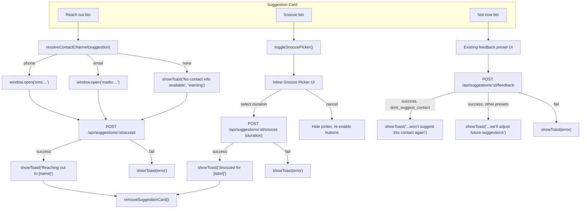

# Design Document: UI Suggestion Actions

## Overview

This feature enhances the three action buttons on suggestion cards in the home dashboard. Currently, "Reach out" silently accepts a suggestion, "Snooze" fires immediately with no duration choice, and "Not now" shows a generic toast. The changes are:

1. **Reach Out** — Opens the user's SMS or email app with the contact pre-filled via `sms:` / `mailto:` URI schemes, then calls the accept API. Falls back to email if no phone, shows a warning toast if neither is available.
2. **Snooze** — Shows an inline duration picker (3 days / 1 week / 2 weeks) on the card before sending the snooze request with the chosen duration in hours.
3. **Not Now** — Updates the dismissal toast messages to be more informative based on the feedback preset selected.

All changes are frontend-only in `public/js/home-dashboard.js` and `public/css/dashboard-tabs.css`. The backend API endpoints (`/accept`, `/snooze`, `/feedback`) already support the required payloads — no backend changes are needed.

## Architecture



## Components and Interfaces

### Modified Functions (public/js/home-dashboard.js)

#### `handleSuggestionAccept(suggestionId)`
Currently calls the accept API and shows a generic toast. Will be updated to:
1. Look up the suggestion from `dashboardData.suggestions` by ID.
2. Call `resolveContactChannel(suggestion)` to determine phone/email/none.
3. Open `sms:{phone}` or `mailto:{email}` via `window.open()`.
4. Call `POST /api/suggestions/:id/accept`.
5. Show contextual toast: "Reaching out to [name]" on success, "No contact info available" (warning) if no channel, error toast on API failure.
6. Remove the card on success.

#### `handleSuggestionSnooze(suggestionId)`
Currently sends a snooze request immediately with no duration. Will be updated to:
1. Toggle an inline snooze picker on the card (similar pattern to the existing feedback UI).
2. If picker is already visible, hide it and re-enable buttons.
3. On duration selection, send `POST /api/suggestions/:id/snooze` with `{ duration }` in hours.
4. Show "Snoozed for [label]" toast on success, error toast on failure.

#### `submitFeedback(suggestionId, preset, comment)`
Currently shows "Suggestion dismissed" on success. Will be updated to:
- Show "Got it, we won't suggest this contact again" when preset is `dont_suggest_contact`.
- Show "Got it, we'll adjust future suggestions" for all other presets.
- Show "Failed to dismiss suggestion. Please try again." on API failure.

### New Functions

#### `resolveContactChannel(suggestion)`
Pure function that returns `{ type: 'sms' | 'email' | 'none', value: string, contactName: string }`.
- Uses `suggestion.contacts[0]` (first contact).
- Prefers `phone` over `email`.
- Returns `{ type: 'none' }` if neither exists.

#### `renderSnoozePicker(suggestionId)`
Returns an HTML string for the inline snooze picker with:
- Prompt text: "Snooze for how long?"
- Three duration buttons: "3 days" (72h), "1 week" (168h), "2 weeks" (336h)
- Cancel button
- `role="group"` and `aria-label="Snooze duration options"`

#### `handleSnoozeSelect(suggestionId, durationHours, durationLabel)`
Called when a duration button is clicked. Sends the snooze API request and handles success/failure.

#### `cancelSnooze(suggestionId)`
Removes the snooze picker from the card and re-enables action buttons.

### CSS Changes (public/css/dashboard-tabs.css)

New `.snooze-picker` styles following the same pattern as `.suggestion-feedback`:
- `.snooze-picker` — container with top border, padding
- `.snooze-picker__prompt` — prompt text
- `.snooze-picker__options` — flex row of duration buttons
- `.snooze-picker__option` — pill-style buttons (same as feedback options)
- `.snooze-picker__cancel` — cancel link

## Data Models

No new data models are introduced. The feature uses existing data structures:

### Suggestion Object (from API)
```typescript
interface Suggestion {
  id: string;
  type: 'individual' | 'group';
  contacts: Contact[];       // Array of contacts
  contactName?: string;      // Legacy fallback
  reasoning?: string;
  status: string;
  // ... other fields
}
```

### Contact Object (within suggestion.contacts)
```typescript
interface Contact {
  id: string;
  name: string;
  email?: string;
  phone?: string;
}
```

### Snooze Duration Map
```typescript
const SNOOZE_DURATIONS = [
  { label: '3 days',  hours: 72  },
  { label: '1 week',  hours: 168 },
  { label: '2 weeks', hours: 336 },
];
```

### resolveContactChannel Return Type
```typescript
interface ContactChannel {
  type: 'sms' | 'email' | 'none';
  value: string;         // phone number or email address
  contactName: string;   // display name for toast
}
```


## Correctness Properties

*A property is a characteristic or behavior that should hold true across all valid executions of a system — essentially, a formal statement about what the system should do. Properties serve as the bridge between human-readable specifications and machine-verifiable correctness guarantees.*

### Property 1: Contact channel resolution prefers phone over email

*For any* suggestion whose first contact has a non-empty `phone` field (regardless of whether `email` is also present), `resolveContactChannel` shall return `{ type: 'sms', value: phone }`. *For any* suggestion whose first contact has a non-empty `email` but no `phone`, it shall return `{ type: 'email', value: email }`. *For any* suggestion whose first contact has neither `phone` nor `email`, it shall return `{ type: 'none' }`.

**Validates: Requirements 1.1, 1.2, 1.3, 1.4, 2.1, 2.2, 2.3**

### Property 2: Channel resolution returns first contact's name

*For any* suggestion with a non-empty `contacts` array, `resolveContactChannel` shall return a `contactName` equal to the `name` field of `contacts[0]`.

**Validates: Requirements 6.1**

### Property 3: Dismissal toast message selection

*For any* feedback preset value, when the preset is `dont_suggest_contact` the dismissal toast message shall be "Got it, we won't suggest this contact again". *For any* other valid preset, the dismissal toast message shall be "Got it, we'll adjust future suggestions".

**Validates: Requirements 5.1, 5.2**

## Error Handling

| Scenario | Behavior |
|---|---|
| Accept API call fails | Show error toast "Failed to accept suggestion. Please try again.", re-enable card buttons |
| Snooze API call fails | Show error toast "Failed to snooze suggestion. Please try again.", re-enable card buttons, keep picker visible |
| Feedback API call fails | Show error toast "Failed to dismiss suggestion. Please try again.", re-enable feedback buttons |
| No contact info on reach out | Show warning toast "No contact info available", still call accept API |
| `contacts` array is empty or missing | `resolveContactChannel` returns `{ type: 'none', value: '', contactName: 'Unknown' }` |
| `window.open` blocked by browser | Accept API still fires; toast still shows. The URI scheme open is best-effort. |

## Testing Strategy

### Property-Based Tests (fast-check)

Use `fast-check` with minimum 100 iterations per property. Each test references its design property.

**Test file:** `src/matching/suggestion-actions.test.ts` (or co-located with a new pure-function module if extracted)

Since the testable properties are all about the pure `resolveContactChannel` function and the toast message selection logic, these functions should be extracted into a testable module (or tested inline with the dashboard JS via a test harness).

```
Property 1: Contact channel resolution
- Generate random Contact objects with arbitrary combinations of phone/email/undefined
- Assert resolveContactChannel returns the correct type based on the priority rules
- Tag: Feature: 035-ui-suggestion-actions, Property 1: Contact channel resolution prefers phone over email

Property 2: Channel resolution returns first contact's name
- Generate random suggestions with random contact names
- Assert the returned contactName matches contacts[0].name
- Tag: Feature: 035-ui-suggestion-actions, Property 2: Channel resolution returns first contact's name

Property 3: Dismissal toast message selection
- Generate random preset strings from the valid preset list
- Assert the correct toast message is returned based on whether preset === 'dont_suggest_contact'
- Tag: Feature: 035-ui-suggestion-actions, Property 3: Dismissal toast message selection
```

### Unit / Example Tests

- Snooze picker renders with correct duration labels and hours mapping (3.1, 3.5)
- Snooze picker HTML contains `role="group"` and `aria-label` (4.1)
- Snooze picker HTML contains prompt text (4.2)
- Snooze toggle hides picker on second click (3.3)
- Cancel button removes picker and re-enables buttons (3.4)
- Accept API is called regardless of contact info availability (1.5)
- Card is removed after successful accept (1.6)
- Error toast on snooze API failure (3.7)
- Error toast on accept API failure (6.3)
- Error toast on feedback API failure (5.3)

### Manual HTML Test

Add a test file `tests/html/suggestion-actions.html` that renders mock suggestion cards with various contact data combinations to visually verify:
- Reach out opens correct URI scheme
- Snooze picker appears/disappears correctly
- Toast messages display with correct text
- Accessibility attributes are present
