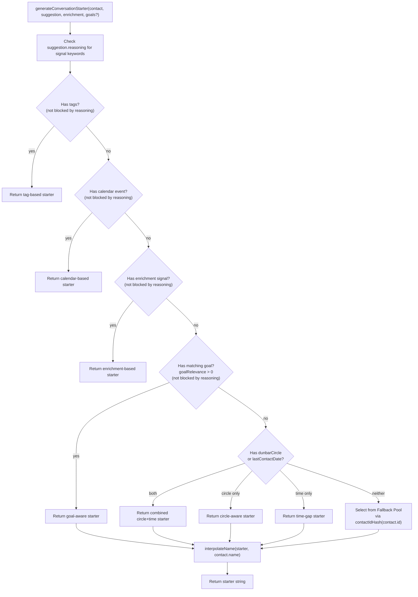

# Design Document: Context-Aware Conversation Starters

## Overview

This feature replaces the single hardcoded fallback conversation starter in `generateConversationStarter` / `generateConversationStarterWithTopics` with a layered, context-aware generation system. The current fallback path always returns `"It's been a while — a simple 'how are you?' goes a long way"` for every contact that lacks tags, calendar events, or enrichment data — which is the majority of contacts.

The changes are:

1. **Fallback Pool** — A static array of 15–20 varied starter strings, selected deterministically per contact via a hash of the contact ID.
2. **Dunbar Circle-Aware Starters** — Templates keyed by circle tier (`inner`, `close`, `active`, `casual`) with tone matching the relationship closeness.
3. **Time-Gap-Aware Starters** — Templates keyed by time-since-last-contact buckets (<14d, 14–28d, 29–90d, >90d).
4. **Combined Dunbar + Time-Gap** — When both dimensions are available, a combined starter is produced.
5. **Goal-Aware Starters** — When a contact matches an active `ConnectionGoal`, the starter references the goal context.
6. **Reasoning-Aware Deduplication** — Before selecting a strategy, the suggestion's `reasoning` string is checked for signal keywords to avoid redundancy between the reasoning line and the starter.
7. **Name Interpolation** — All templates use `[name]` placeholders, replaced with the contact's name or "them" if empty.

All changes are in `src/matching/suggestion-service.ts`. No database schema changes, no new API endpoints, no frontend changes.

## Architecture



## Components and Interfaces

### Modified Functions (src/matching/suggestion-service.ts)

#### `generateConversationStarter(contact, suggestion, enrichment, goals?)`

The existing function signature gains an optional `goals` parameter (array of `ConnectionGoal`). The function body is restructured to follow the priority chain:

1. Parse `suggestion.reasoning` for signal keywords (frequency decay, goal reference, shared activity).
2. Existing: tag-based starter (skip if reasoning mentions shared activity).
3. Existing: calendar-based starter (skip if reasoning mentions calendar/shared activity).
4. Existing: enrichment-based starter (skip if reasoning mentions frequency/declining).
5. **New**: goal-aware starter (skip if reasoning mentions a goal).
6. **New**: combined Dunbar circle + time-gap starter (or single-dimension if only one is available).
7. **New**: fallback pool selection via `contactIdHash`.
8. **New**: `interpolateName` applied to the result.

#### `generateConversationStarterWithTopics(contact, suggestion, enrichment, userId)`

Updated to pass active goals through to the synchronous function. Goals are fetched via `ConnectionGoalService.getActiveGoals(userId)` (already available in `loadPendingSuggestions`). The fallback comparison is updated to check against the pool rather than a single string.

### New Pure Functions

#### `contactIdHash(contactId: string): number`
Deterministic hash of a contact ID string to a non-negative integer. Uses a simple DJB2 or FNV-1a style hash. Pure, no side effects.

```typescript
function contactIdHash(id: string): number
```

#### `selectFromPool<T>(pool: T[], contactId: string): T`
Selects an item from an array using `contactIdHash(contactId) % pool.length`. Pure.

```typescript
function selectFromPool<T>(pool: T[], contactId: string): T
```

#### `interpolateName(template: string, name: string): string`
Replaces all `[name]` occurrences in the template with the contact's name, or `"them"` if the name is empty/whitespace.

```typescript
function interpolateName(template: string, name: string): string
```

#### `getTimeGapBucket(lastContactDate: Date, now?: Date): 'recent' | 'moderate' | 'long' | 'significant'`
Categorizes the time gap into one of four buckets based on days since last contact.

```typescript
function getTimeGapBucket(lastContactDate: Date, now?: Date): string
```

#### `isReasoningSignal(reasoning: string, signals: string[]): boolean`
Checks if the reasoning string contains any of the given signal keywords (case-insensitive).

```typescript
function isReasoningSignal(reasoning: string | undefined, signals: string[]): boolean
```

### New Constants

#### `FALLBACK_POOL: string[]`
Array of 15–20 varied generic conversation starters. Each may contain `[name]`.

#### `CIRCLE_STARTERS: Record<string, string[]>`
Map from Dunbar circle tier to an array of 3+ starter templates.

#### `TIME_GAP_STARTERS: Record<string, string[]>`
Map from time-gap bucket to an array of 2+ starter templates.

#### `COMBINED_STARTERS: Record<string, Record<string, string[]>>`
Nested map: `circle → timeGapBucket → string[]` for the most common combinations. Falls back to single-dimension if a combination key is missing.

#### `GOAL_STARTERS: { network: string[], reconnect: string[], generic: string[] }`
Goal-aware templates keyed by goal keyword category.

## Data Models

No new database tables or schema changes. The feature operates entirely on existing data structures.

### Existing Types Used

```typescript
// From src/types/index.ts
interface Contact {
  id: string;
  name: string;
  dunbarCircle?: 'inner' | 'close' | 'active' | 'casual';
  lastContactDate?: Date;
  tags: Tag[];
  groups: string[];
  // ...
}

interface Suggestion {
  reasoning: string;
  triggerType: TriggerType;
  calendarEventId?: string;
  // ...
}

interface ConnectionGoal {
  id: string;
  text: string;
  keywords: string[];
  status: 'active' | 'completed' | 'archived';
  // ...
}
```

### EnrichmentSignal (from suggestion-service.ts)
```typescript
interface EnrichmentSignal {
  frequencyTrend: 'increasing' | 'stable' | 'declining';
  topPlatform: string | null;
  lastMessageDate: Date | null;
  // ...
}
```

### Template Data Shapes

```typescript
// Fallback pool — 15-20 strings
const FALLBACK_POOL: string[] = [
  "A quick hello to [name] could brighten both your days",
  "Drop [name] a line — no reason needed",
  // ... 13-18 more
];

// Circle starters — 3+ per tier
const CIRCLE_STARTERS: Record<string, string[]> = {
  inner: [
    "Check in on how [name]'s doing — you two go way back",
    // ...2+ more
  ],
  close: [ /* 3+ */ ],
  active: [ /* 3+ */ ],
  casual: [ /* 3+ */ ],
};

// Time gap starters — 2+ per bucket
const TIME_GAP_STARTERS: Record<string, string[]> = {
  recent: [ /* 2+ */ ],
  moderate: [ /* 2+ */ ],
  long: [ /* 2+ */ ],
  significant: [ /* 2+ */ ],
};
```


## Correctness Properties

*A property is a characteristic or behavior that should hold true across all valid executions of a system — essentially, a formal statement about what the system should do. Properties serve as the bridge between human-readable specifications and machine-verifiable correctness guarantees.*

### Property 1: Template pool size invariants

*For any* inspection of the template data structures: `FALLBACK_POOL` shall have between 15 and 20 unique entries, each `CIRCLE_STARTERS[tier]` shall have at least 3 entries for every tier in `['inner', 'close', 'active', 'casual']`, and each `TIME_GAP_STARTERS[bucket]` shall have at least 2 entries for every bucket in `['recent', 'moderate', 'long', 'significant']`.

**Validates: Requirements 1.1, 2.6, 3.6**

### Property 2: Hash determinism

*For any* contact ID string, `contactIdHash(id)` shall return the same non-negative integer on every invocation. Consequently, `selectFromPool(pool, id)` shall return the same element for the same pool and ID across repeated calls.

**Validates: Requirements 1.3, 2.7, 3.7**

### Property 3: Hash distribution across fallback pool

*For any* set of 50 randomly generated contact ID strings, when each is mapped to a `FALLBACK_POOL` index via `contactIdHash(id) % FALLBACK_POOL.length`, the number of colliding pairs (different IDs mapping to the same index) shall be below 15% of the total pairs.

**Validates: Requirements 1.4, 1.5**

### Property 4: Fallback pool membership

*For any* contact with no tags, no calendar event, no enrichment signal, no matching goals, no Dunbar circle, and no last contact date, `generateConversationStarter` shall return a string that (after name interpolation) matches one of the entries in `FALLBACK_POOL` (with `[name]` replaced).

**Validates: Requirements 1.2**

### Property 5: Circle-tier starter correctness

*For any* contact with a `dunbarCircle` value in `['inner', 'close', 'active', 'casual']`, no tags, no calendar event, no enrichment signal, no matching goals, and no `lastContactDate`, `generateConversationStarter` shall return a string (before name interpolation) that is a member of `CIRCLE_STARTERS[contact.dunbarCircle]`.

**Validates: Requirements 2.1, 2.2, 2.3, 2.4, 2.5**

### Property 6: Time-gap bucket starter correctness

*For any* contact with a `lastContactDate` and no `dunbarCircle`, no tags, no calendar event, no enrichment signal, and no matching goals, `generateConversationStarter` shall return a string (before name interpolation) that is a member of `TIME_GAP_STARTERS[getTimeGapBucket(contact.lastContactDate)]`.

**Validates: Requirements 3.1, 3.2, 3.3, 3.4, 3.5**

### Property 7: Goal-aware starter correctness

*For any* contact with at least one matching `ConnectionGoal` (goal relevance > 0), no tags, no calendar event, and no enrichment signal, `generateConversationStarter` shall return a string from the `GOAL_STARTERS` templates. When the matching goal's keywords include "network" or "professional", the starter shall come from `GOAL_STARTERS.network`. When the keywords include "reconnect" and the contact's circle is `inner` or `close`, the starter shall come from `GOAL_STARTERS.reconnect`.

**Validates: Requirements 4.1, 4.2, 4.3, 4.5**

### Property 8: Reasoning-aware deduplication

*For any* suggestion whose `reasoning` contains "frequency decay" or "declining", the returned starter shall not contain the words "frequency" or "declining". *For any* suggestion whose `reasoning` references a connection goal, the returned starter shall not come from `GOAL_STARTERS`. *For any* suggestion whose `reasoning` contains "shared activity", the returned starter shall not be a calendar-based starter.

**Validates: Requirements 5.1, 5.2, 5.3, 6.3**

### Property 9: Priority chain ordering

*For any* contact that qualifies for multiple starter strategies simultaneously, the strategy with the highest priority shall win: (1) tag/shared-interest > (2) calendar > (3) enrichment > (4) goal-aware > (5) Dunbar+time-gap > (6) fallback pool. Specifically, if a contact has both tags and a matching goal, the tag-based starter shall be returned, not the goal-aware one.

**Validates: Requirements 6.1, 6.2, 4.4**

### Property 10: Non-empty output invariant

*For any* contact (with any combination of present or absent data fields), `generateConversationStarter` shall return a non-empty string. The fallback pool guarantees this as the final catch-all.

**Validates: Requirements 6.4**

### Property 11: Name interpolation completeness

*For any* contact and any starter strategy, the returned string shall never contain the literal substring `[name]`. If the contact's `name` is non-empty, the returned string shall contain the contact's name. If the contact's `name` is empty, the returned string shall contain `"them"` in place of where `[name]` would have been.

**Validates: Requirements 7.1, 7.2, 7.3**

### Property 12: Combined dimension starters

*For any* contact with both a `dunbarCircle` and a `lastContactDate` (and no higher-priority context), the returned starter shall come from the combined Dunbar+time-gap template set. *For any* contact with only one of these dimensions, the returned starter shall come from the corresponding single-dimension template set.

**Validates: Requirements 8.1, 8.4**

## Error Handling

| Scenario | Behavior |
|---|---|
| `contact.id` is undefined or empty | `contactIdHash` returns 0, selecting the first pool item — always produces a valid starter |
| `contact.name` is null/undefined | `interpolateName` treats it as empty string, substitutes "them" |
| `goals` parameter is undefined/null | Treated as empty array, goal-aware strategy is skipped |
| `suggestion.reasoning` is undefined/null | `isReasoningSignal` returns false, no strategies are blocked |
| `lastContactDate` is an invalid Date | `getTimeGapBucket` returns undefined, time-gap strategy is skipped, falls through to next |
| `enrichment` is null | Enrichment strategy is skipped (existing behavior preserved) |
| `ConnectionGoalService.getActiveGoals` throws | Caught in `generateConversationStarterWithTopics`, goals treated as empty array |
| Template pool is accidentally empty | `selectFromPool` returns undefined, caught by non-empty check, falls through to next strategy |

## Testing Strategy

### Property-Based Tests (fast-check)

Use `fast-check` with minimum 100 iterations per property. Each test references its design property.

Test file: `src/matching/suggestion-starters.test.ts`

All new pure functions (`contactIdHash`, `selectFromPool`, `interpolateName`, `getTimeGapBucket`, `isReasoningSignal`) and the template constants are exported for direct testing. The refactored `generateConversationStarter` is tested with mock contacts/suggestions.

```
Property 1: Template pool size invariants
- Check FALLBACK_POOL.length is 15-20 and all entries are unique
- Check each CIRCLE_STARTERS tier has >= 3 entries
- Check each TIME_GAP_STARTERS bucket has >= 2 entries
- Tag: Feature: 036-ui-suggestion-starters, Property 1: Template pool size invariants

Property 2: Hash determinism
- Generate random strings, call contactIdHash twice, assert equal results
- Generate random strings, call selectFromPool with same pool, assert same element
- Tag: Feature: 036-ui-suggestion-starters, Property 2: Hash determinism

Property 3: Hash distribution
- Generate 50 random UUIDs, hash to pool indices, count collisions, assert < 15%
- Tag: Feature: 036-ui-suggestion-starters, Property 3: Hash distribution across fallback pool

Property 4: Fallback pool membership
- Generate random contacts with no context data, assert result is in FALLBACK_POOL (after un-interpolating name)
- Tag: Feature: 036-ui-suggestion-starters, Property 4: Fallback pool membership

Property 5: Circle-tier starter correctness
- Generate random contacts with a random dunbarCircle and no other context, assert result is in CIRCLE_STARTERS[circle]
- Tag: Feature: 036-ui-suggestion-starters, Property 5: Circle-tier starter correctness

Property 6: Time-gap bucket starter correctness
- Generate random contacts with a random lastContactDate and no dunbarCircle/other context, assert result is in TIME_GAP_STARTERS[bucket]
- Tag: Feature: 036-ui-suggestion-starters, Property 6: Time-gap bucket starter correctness

Property 7: Goal-aware starter correctness
- Generate random contacts with matching goals and no higher-priority context, assert result is in GOAL_STARTERS
- Tag: Feature: 036-ui-suggestion-starters, Property 7: Goal-aware starter correctness

Property 8: Reasoning-aware deduplication
- Generate suggestions with reasoning containing signal keywords, assert starter avoids redundant content
- Tag: Feature: 036-ui-suggestion-starters, Property 8: Reasoning-aware deduplication

Property 9: Priority chain ordering
- Generate contacts qualifying for multiple strategies, assert highest-priority wins
- Tag: Feature: 036-ui-suggestion-starters, Property 9: Priority chain ordering

Property 10: Non-empty output invariant
- Generate arbitrary contacts with random combinations of fields, assert result is always non-empty string
- Tag: Feature: 036-ui-suggestion-starters, Property 10: Non-empty output invariant

Property 11: Name interpolation completeness
- Generate random contacts with random names (including empty), assert [name] never appears in output
- Tag: Feature: 036-ui-suggestion-starters, Property 11: Name interpolation completeness

Property 12: Combined dimension starters
- Generate contacts with both dunbarCircle and lastContactDate, assert result comes from combined templates
- Tag: Feature: 036-ui-suggestion-starters, Property 12: Combined dimension starters
```

### Unit / Example Tests

- `contactIdHash` returns non-negative integer for known IDs
- `getTimeGapBucket` returns correct bucket for boundary values (exactly 14 days, exactly 28 days, exactly 90 days)
- `interpolateName` with multiple `[name]` placeholders replaces all occurrences
- `isReasoningSignal` is case-insensitive
- Combined starter for inner + >90 days produces urgent-warm tone (Req 8.2)
- Combined starter for casual + <14 days produces light-recent tone (Req 8.3)
- Goal starter with "network" keyword selects from network templates (Req 4.2)
- Goal starter with "reconnect" keyword and inner circle selects from reconnect templates (Req 4.3)
- Existing tag-based and calendar-based starters still work unchanged (regression)
- `generateConversationStarterWithTopics` passes goals through correctly

### Manual HTML Test

The existing `tests/html/suggestion-cards.html` can be used to visually verify that suggestion cards display varied starters across different contacts. No new HTML test file needed since the change is backend-only and the card rendering already displays the `conversationStarter` field.
