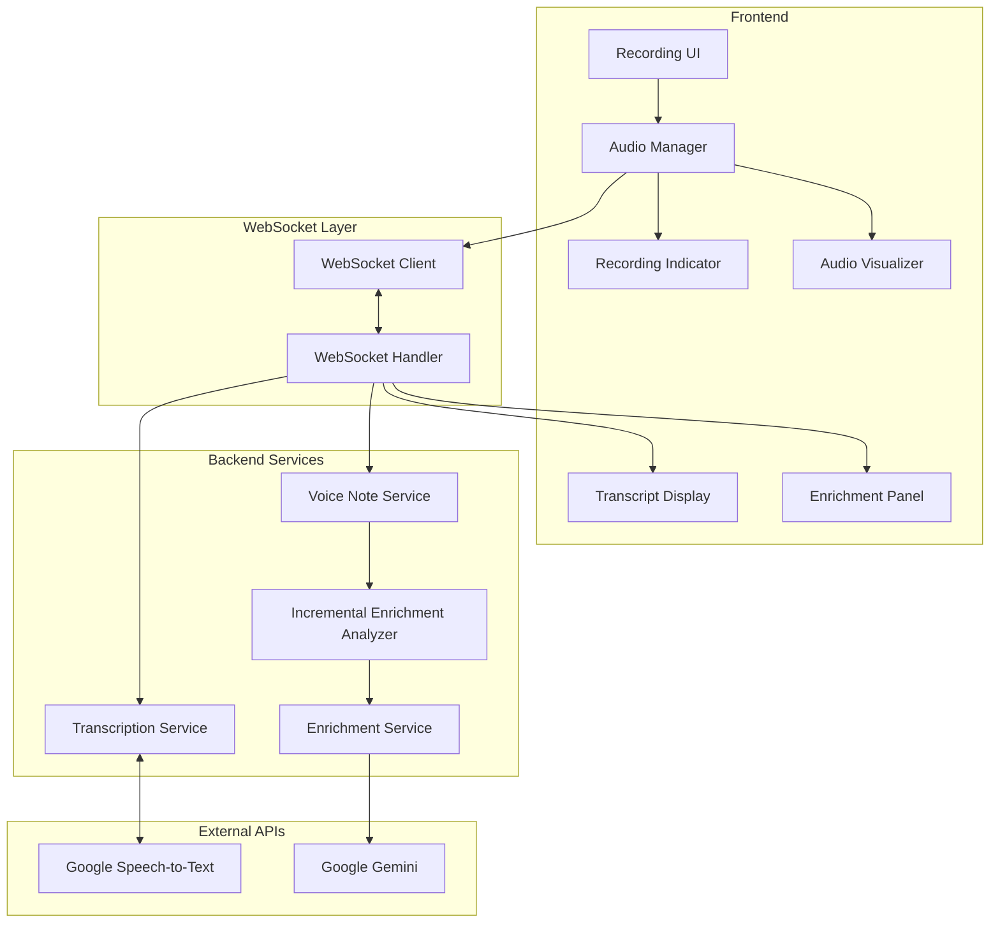

# Design Document: Incremental Voice Transcription

## Overview

This design describes the architecture for real-time, incremental voice transcription with progressive enrichment analysis. The system streams audio to Google Speech-to-Text API, displays interim and final transcripts dynamically, triggers enrichment analysis at natural breakpoints, and provides a persistent recording indicator with audio visualization.

The design builds on the existing `TranscriptionService`, `VoiceNoteService`, and `VoiceNoteWebSocketHandler` components, enhancing them with incremental processing capabilities and a more dynamic frontend experience.

## Architecture



## Components and Interfaces

### 1. AudioManager (Frontend)

Manages audio capture, encoding, and streaming with pause/resume support.

```typescript
interface AudioManagerConfig {
  sampleRate: number;        // 16000 Hz
  chunkIntervalMs: number;   // 100ms
  maxBufferSizeBytes: number; // 100MB
  silenceThresholdDb: number; // -50dB
  silenceTimeoutMs: number;   // 3000ms
}

interface AudioManager {
  // Lifecycle
  start(): Promise<void>;
  pause(): void;
  resume(): void;
  stop(): Promise<AudioBlob>;
  
  // State
  isRecording(): boolean;
  isPaused(): boolean;
  getElapsedTime(): number;
  
  // Events
  onAudioChunk: (chunk: ArrayBuffer) => void;
  onLevelChange: (level: number) => void;
  onSilenceDetected: () => void;
  onClippingDetected: () => void;
  onLowLevelDetected: () => void;
}
```

### 2. RecordingIndicator (Frontend)

Persistent UI component showing recording state.

```typescript
interface RecordingIndicatorState {
  isRecording: boolean;
  isPaused: boolean;
  elapsedTime: number;
  connectionStatus: 'connected' | 'reconnecting' | 'disconnected';
  reconnectAttempt?: number;
}

interface RecordingIndicator {
  show(state: RecordingIndicatorState): void;
  hide(): void;
  updateTime(seconds: number): void;
  updateConnectionStatus(status: ConnectionStatus): void;
  showNavigationWarning(): Promise<boolean>;
}
```

### 3. TranscriptManager (Frontend)

Manages transcript state with interim/final text handling.

```typescript
interface TranscriptSegment {
  id: string;
  text: string;
  isFinal: boolean;
  confidence: number;
  timestamp: number;
  isPauseMarker?: boolean;
}

interface TranscriptManager {
  // State management
  addInterimText(text: string, confidence: number): void;
  finalizeText(text: string, confidence: number): void;
  insertPauseMarker(): void;
  
  // Queries
  getFinalTranscript(): string;
  getFullTranscript(): string;
  getWordCount(): number;
  
  // Rendering
  render(): HTMLElement;
}
```

### 4. IncrementalEnrichmentAnalyzer (Backend)

Triggers enrichment analysis at natural breakpoints.

```typescript
interface EnrichmentTriggerConfig {
  minWordCount: number;      // 50 words
  pauseThresholdMs: number;  // 2000ms
  maxPendingWords: number;   // 200 words
}

interface IncrementalEnrichmentAnalyzer {
  // Process new transcript text
  processTranscript(
    sessionId: string,
    newText: string,
    isFinal: boolean
  ): Promise<void>;
  
  // Get current suggestions
  getSuggestions(sessionId: string): EnrichmentSuggestion[];
  
  // Finalize and merge all suggestions
  finalize(sessionId: string): Promise<MultiContactEnrichmentProposal>;
}

interface EnrichmentSuggestion {
  id: string;
  type: 'tag' | 'note' | 'interest' | 'event';
  value: string;
  confidence: number;
  sourceText: string;
  contactHint?: string;
}
```

### 5. Enhanced WebSocket Messages

Extended message types for incremental updates.

```typescript
// Client -> Server
type ClientMessage = 
  | { type: 'start_session'; languageCode?: string }
  | { type: 'audio_chunk'; data: ArrayBuffer }
  | { type: 'pause_session' }
  | { type: 'resume_session' }
  | { type: 'end_session'; userContacts: Contact[] }
  | { type: 'cancel_session' };

// Server -> Client
type ServerMessage =
  | { type: 'session_started'; sessionId: string }
  | { type: 'interim_transcript'; text: string; confidence: number }
  | { type: 'final_transcript'; text: string; confidence: number; fullText: string }
  | { type: 'enrichment_update'; suggestions: EnrichmentSuggestion[] }
  | { type: 'status_change'; status: SessionStatus }
  | { type: 'connection_status'; status: ConnectionStatus; attempt?: number }
  | { type: 'error'; message: string; recoverable: boolean }
  | { type: 'session_finalized'; voiceNote: VoiceNote; proposal: MultiContactEnrichmentProposal };
```

## Data Models

### TranscriptState

```typescript
interface TranscriptState {
  sessionId: string;
  segments: TranscriptSegment[];
  currentInterim: string | null;
  wordCount: number;
  lastFinalizedAt: number;
}
```

### EnrichmentState

```typescript
interface EnrichmentState {
  sessionId: string;
  suggestions: EnrichmentSuggestion[];
  processedWordCount: number;
  lastAnalyzedAt: number;
  pendingText: string;
}
```

### RecordingSession (Enhanced)

```typescript
interface RecordingSession {
  id: string;
  userId: string;
  status: 'recording' | 'paused' | 'transcribing' | 'extracting' | 'ready' | 'error';
  startTime: Date;
  pausedAt?: Date;
  totalPausedDuration: number;
  transcriptState: TranscriptState;
  enrichmentState: EnrichmentState;
  audioBuffer: ArrayBuffer[];
  bufferSizeBytes: number;
}
```

## Correctness Properties

*A property is a characteristic or behavior that should hold true across all valid executions of a system-essentially, a formal statement about what the system should do. Properties serve as the bridge between human-readable specifications and machine-verifiable correctness guarantees.*

### Property 1: Final transcript preservation

*For any* sequence of transcript updates (interim and final), all finalized text segments SHALL remain unchanged when new interim text arrives. The final transcript is append-only.

**Validates: Requirements 1.3, 1.4**

### Property 2: Suggestion merge consistency

*For any* two sets of enrichment suggestions, merging them SHALL produce a set containing all unique suggestions, with duplicates consolidated to the highest-confidence version.

**Validates: Requirements 2.3, 2.4**

### Property 3: Silence detection threshold

*For any* sequence of audio levels, silence SHALL be detected if and only if all levels in a 3-second window are below the silence threshold (-50dB).

**Validates: Requirements 4.3**

### Property 4: Audio level warning accuracy

*For any* audio level value, the system SHALL display a low-level warning if level < -40dB, a clipping warning if level >= 0dB, and no warning otherwise.

**Validates: Requirements 4.4, 4.5**

### Property 5: Reconnection backoff timing

*For any* sequence of reconnection attempts, the delay between attempt N and N+1 SHALL equal min(initialDelay * 2^N, maxDelay).

**Validates: Requirements 5.1**

### Property 6: Buffer integrity after reconnect

*For any* sequence of audio chunks buffered during disconnection, all chunks SHALL be transmitted in order after successful reconnection, with no data loss.

**Validates: Requirements 5.2, 5.5**

### Property 7: Pause/resume transcript round-trip

*For any* transcript state before pause, resuming and adding new text SHALL preserve all previous final text and append new text after a pause marker.

**Validates: Requirements 6.1, 6.2, 6.5**

### Property 8: Pause timeout trigger

*For any* pause duration exceeding 5 minutes (300 seconds), the system SHALL trigger a timeout prompt exactly once.

**Validates: Requirements 6.4**

### Property 9: Memory buffer bounds

*For any* recording session, the audio buffer size SHALL never exceed the configured maximum (100MB), with older segments flushed when the limit is approached.

**Validates: Requirements 7.4**

### Property 10: Long recording segmentation

*For any* recording exceeding 10 minutes, the audio SHALL be segmented into chunks of at most 10 minutes each for processing.

**Validates: Requirements 7.5**

### Property 11: Enrichment trigger threshold

*For any* transcript with N words where N >= 50, or after a natural pause of 2+ seconds, the enrichment analyzer SHALL be triggered.

**Validates: Requirements 2.1**

### Property 12: Elapsed time accuracy

*For any* recording session with duration D seconds (excluding paused time), the displayed elapsed time SHALL equal D ± 1 second.

**Validates: Requirements 3.2**

### Property 13: Streaming latency bound

*For any* audio recording start event, the first audio chunk SHALL be sent to the transcription service within 500 milliseconds.

**Validates: Requirements 1.1**

### Property 14: Confidence-based text styling

*For any* transcript segment with confidence C, the rendered text SHALL have distinct styling: low (C < 0.7), medium (0.7 <= C < 0.9), high (C >= 0.9).

**Validates: Requirements 1.5**

## Error Handling

### Network Errors

1. **WebSocket Disconnect**: Buffer audio locally, attempt reconnection with exponential backoff (1s, 2s, 4s max 10s)
2. **Reconnection Failure**: After 3 attempts, notify user and offer to save audio for later transcription
3. **Transcription API Error**: Log error, continue buffering, retry on next chunk

### Audio Errors

1. **Microphone Access Denied**: Display clear error message with instructions to enable permissions
2. **Audio Context Failure**: Fall back to basic MediaRecorder without visualization
3. **Memory Limit Reached**: Flush oldest audio segments, warn user about long recording

### State Errors

1. **Invalid State Transition**: Log warning, attempt recovery to last valid state
2. **Session Not Found**: Create new session transparently if possible
3. **Enrichment Failure**: Continue with transcript-only mode, retry enrichment on finalize

## Testing Strategy

### Unit Tests

- TranscriptManager state transitions
- EnrichmentSuggestion merging logic
- Audio level detection thresholds
- Reconnection backoff calculations
- Pause/resume state preservation

### Property-Based Tests

Using fast-check for JavaScript property-based testing:

1. **Transcript preservation**: Generate random sequences of interim/final updates, verify final text is never modified
2. **Suggestion deduplication**: Generate random suggestion sets with duplicates, verify merge produces unique set with highest confidence
3. **Buffer integrity**: Generate random chunk sequences with simulated disconnects, verify all chunks transmitted after reconnect
4. **Memory bounds**: Generate long recording scenarios, verify buffer never exceeds limit

### Integration Tests

- Full recording flow with mocked transcription service
- WebSocket reconnection scenarios
- Pause/resume with transcript continuity
- Enrichment trigger at word count threshold

### E2E Tests

- Complete voice note recording with real UI
- Navigation warning during recording
- Tab focus/blur handling
